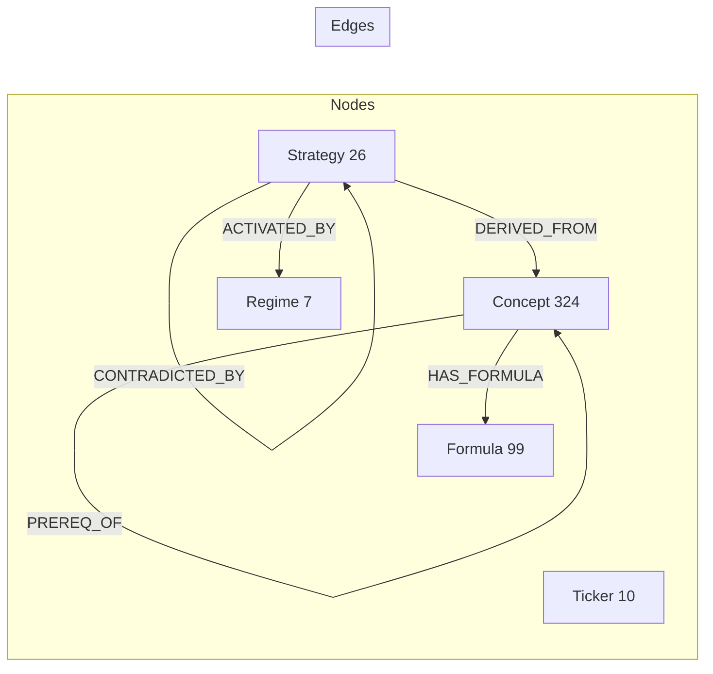

# GraphAlpha — Hackathon Submission

**Knowledge Graph-Grounded Autonomous Trading Agent on Alpaca**

---

## One-liner

GraphAlpha is a multi-agent trading system where every decision is grounded in a live 324-concept financial knowledge graph, producing statistically validated signals with isolated risk management — now trading on Alpaca paper.

## The 30-Second Demo Flow

1. **RegimeAgent** classifies market as "BearMarket" → queries Neo4j for `ACTIVATED_BY` strategies
2. **SignalAgent** runs GARCH + Bayesian Network + LLM sentiment fusion (70/30) on each active strategy
3. KG checks `CONTRADICTED_BY` edges → blocks conflicting signals
4. **RiskAgent** applies half-Kelly sizing + parametric VaR (99%) + sector caps
5. **ExecutionAgent** routes approved orders to **Alpaca paper trading**
6. React dashboard shows live KG graph, P&L, agent logs via WebSocket

## Why This Wins

- **KG-grounded decisions**: No other agent system uses a causal financial knowledge graph as the runtime constraint layer
- **Statistical rigor**: Jobson-Korkie test (p < 0.05) proves KG grounding adds alpha
- **Isolated risk agent**: Conflict-of-interest-free pre-trade validation
- **Live learning**: VARLiNGAM weekly refit updates `TRANSMITS_TO` causal edges
- **Full stack**: React dashboard + FastAPI + WebSocket + Prometheus + Grafana
- **Alpaca-native**: Autonomous paper trading via Alpaca Trading API + MCP server bridge

## Tech Stack

| Layer | Technology |
|-------|-----------|
| Knowledge Graph | Neo4j 5.x (324 concepts, 26 strategies, 99 formulas) |
| Agent Orchestration | Python asyncio (7 sub-agents, 5-min cycle) |
| LLM Sentiment | Groq / Featherless (Llama 3.3 70B) |
| Execution | Alpaca Trading API (paper trading) |
| Market Data | yfinance + Alpaca Market Data API |
| Backend | FastAPI + WebSocket + Prometheus |
| Frontend | React + Vite + Tailwind + Sigma.js |
| Risk | PostgreSQL (audit log) + Redis (pub/sub) |
| Deployment | Docker Compose (GCP-ready) |

## Quick Start

```bash
git clone <repo-url> && cd graphalpha
cp .env.example .env
# Add your Alpaca paper API keys to .env
docker compose up -d --build
docker compose run --rm graph-loader
```

Access points:
- Frontend: http://localhost:5173
- API docs: http://localhost:8000/docs
- Neo4j Browser: http://localhost:7474

## Alpaca Integration

GraphAlpha now trades on Alpaca paper trading by default:

```bash
# Configure in .env
ALPACA_API_KEY_ID=your_key
ALPACA_API_SECRET_KEY=your_secret
DEFAULT_VENUE=alpaca
TRADING_MODE=paper
```

### Alpaca API Routes

| Method | Path | Description |
|--------|------|-------------|
| GET | `/alpaca/account` | Account info (cash, equity, buying power) |
| GET | `/alpaca/positions` | Current open positions |
| GET | `/alpaca/bars/{symbol}` | Historical bar data |

### Alpaca MCP Bridge

The `alpaca_mcp_bridge.py` module connects to the official `alpacahq/alpaca-mcp-server` for natural-language order placement:

```python
from alpaca_mcp_bridge import _mcp
result = _mcp.call_tool("submit_order", {"symbol": "SPY", "side": "buy", "qty": 1})
```

## Knowledge Graph Schema



## Paper Trading Universe

| Asset | Class | Strategy | Alpaca Symbol |
|-------|-------|----------|---------------|
| SPY | US Equity (Broad) | GARCHVolatility, BayesianMacroRisk | SPY |
| QQQ | US Equity (Tech) | MomentumOverlay | QQQ |
| XLF | US Equity (Financials) | ValueMeanReversion, DYNOTEARSContagion | XLF |
| XLE | US Equity (Energy) | ClimatePhysicalRisk, TrendFollowing | XLE |
| GLD | Commodities (Gold) | CrisisAlpha | GLD |

## Key Differentiators

1. **CONTRADICTED_BY gating** — Blocks strategies whose concepts mutually contradict
2. **Jobson-Korkie statistical test** — Walk-forward backtest with p-value significance
3. **7-agent orchestration** — Regime, Signal, News, Macro, KG, Risk, Execution, Research
4. **VARLiNGAM live learning** — `TRANSMITS_TO` causal edges update weekly
5. **Neo4j knowledge graph** — Migrated from Memgraph to Neo4j 5.x for hackathon

## Judging Criteria Map

| Criterion | How GraphAlpha Delivers |
|-----------|------------------------|
| Application of Technology | Neo4j KG + 7-agent orchestration + Alpaca Trading API + LLM sentiment fusion |
| Presentation | Full-stack dashboard with live KG visualization, WebSocket agent logs, backtest results |
| Business Value | Production-grade risk controls (Kelly, VaR, sector caps), paper trading on Alpaca |
| Originality | KG-grounded signal selection with CONTRADICTED_BY edges — no other trading agent does this |

## Team

Built by [Your Name] — MScFE candidate, WQU.

## License

MIT
