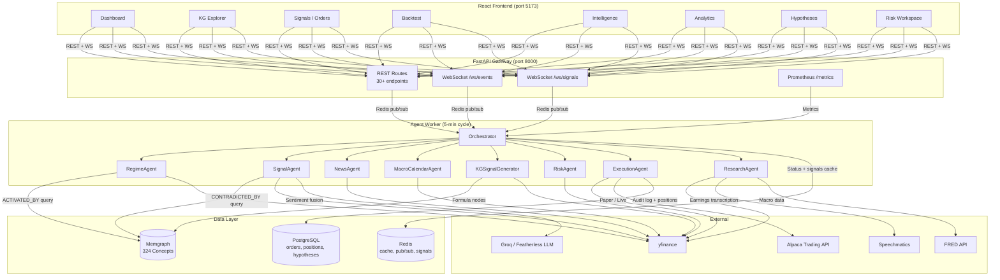
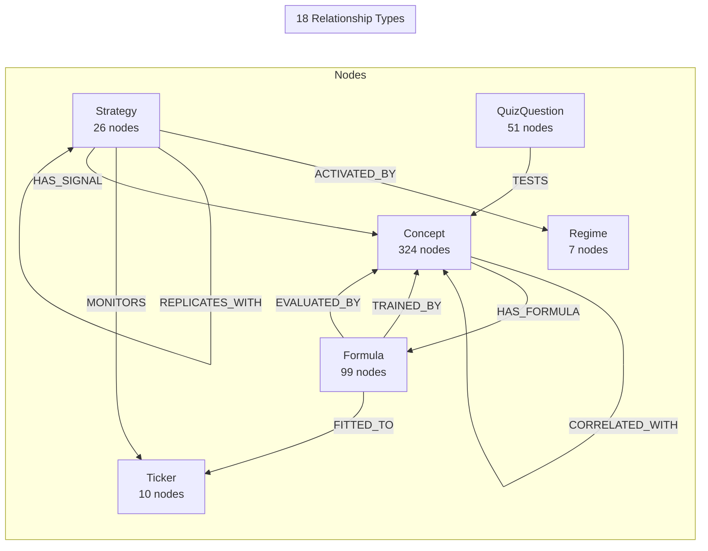
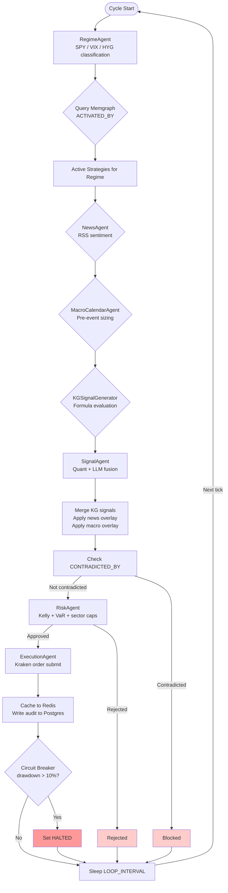
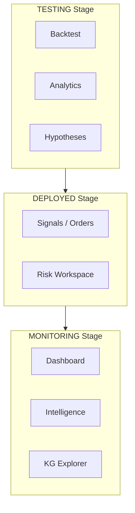
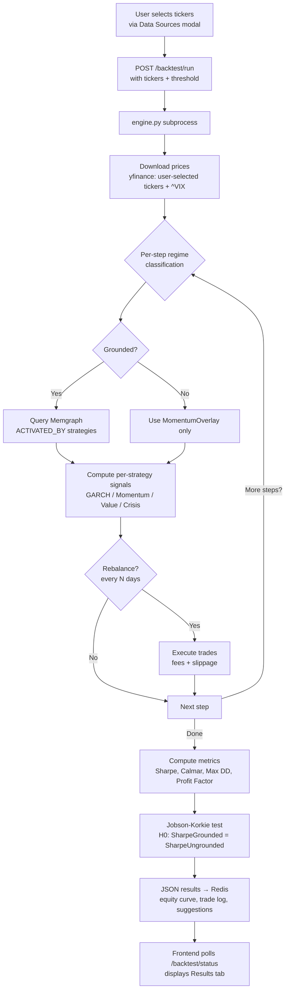

# GraphAlpha

**Knowledge Graph-Grounded Autonomous Trading Agent on Alpaca**

GraphAlpha is a production-grade agentic trading system that grounds every trading decision in a 324-concept financial knowledge graph stored in Neo4j. It fuses quantitative signals with LLM sentiment, executes on Alpaca (paper trading), and provides a full quant workspace via a React dashboard.

---

## File Tree

```
graphalpha/
├── agent/                          # Python agent worker (orchestrator + sub-agents)
│   ├── orchestrator.py             # 7-agent cycle orchestrator
│   ├── regime_agent.py             # Market regime classification (7 regimes)
│   ├── signal_agent.py             # Quant + LLM signal fusion
│   ├── news_agent.py               # RSS sentiment aggregation
│   ├── macro_calendar.py           # Macro event pre-sizing
│   ├── kg_signal_generator.py      # KG Formula node evaluation
│   ├── risk_agent.py               # Kelly + VaR + sector caps
│   ├── execution_agent.py          # Alpaca/Kraken order submission
│   ├── research_agent.py           # VARLiNGAM refit, FRED, Speechmatics
│   ├── Dockerfile
│   └── requirements.txt
│
├── api/                            # FastAPI gateway
│   ├── main.py                     # App entry, CORS, WebSocket, Prometheus
│   ├── routes/
│   │   ├── agent.py                # /agent/status, /agent/risk, /agent/performance
│   │   ├── signals.py              # /signals, /signals/live, /signals/place
│   │   ├── positions.py            # /positions, /positions/portfolio
│   │   ├── market.py               # /market/quotes, /market/data, /market/fred-series
│   │   ├── graph.py                # /graph/nodes, /graph/edges, /graph/query
│   │   ├── backtest.py             # /backtest/run, /backtest/status
│   │   ├── research.py             # 100+ endpoints (KG, strategies, hypotheses, venues)
│   │   ├── analytics.py            # /analytics/forecast, /analytics/pca, etc.
│   │   └── intelligence.py         # /intelligence/news, /intelligence/macro
│   ├── models/                     # Pydantic models
│   ├── schemas/                    # JSON schema v1 (signal, approved_order)
│   ├── common/                     # Schema validator, versioning
│   └── tests/
│
├── frontend/                       # React + Vite + Tailwind
│   ├── src/
│   │   ├── App.tsx                 # Main app with sidebar + routing
│   │   ├── components/
│   │   │   ├── RegimePanel.tsx     # Live regime + confidence
│   │   │   ├── PnLDashboard.tsx    # NAV, P&L, positions table
│   │   │   ├── GraphCanvas.tsx     # Sigma.js KG visualization
│   │   │   ├── AgentLog.tsx        # WebSocket live event stream
│   │   │   ├── SignalsTable.tsx    # Order history + Place Order + Export
│   │   │   ├── OrderDetailDrawer.tsx # Attribution, Lifecycle, KG Path
│   │   │   ├── BacktestWorkspace.tsx # Run, Results, Optimize, Compare, Ablation
│   │   │   ├── RiskWorkspace.tsx   # Overview, Stress, Rebalance, Agents, Parity
│   │   │   ├── IntelligencePanel.tsx # News + Macro calendar
│   │   │   ├── AnalyticsPanel.tsx  # Full quant analytics suite
│   │   │   ├── HypothesisBoard.tsx # Hypothesis lifecycle management
│   │   │   ├── CypherConsole.tsx   # Interactive Cypher query editor
│   │   │   ├── KGEditModal.tsx     # CRUD for KG nodes/edges
│   │   │   ├── ContradictionManager.tsx # Suppress/unsuppress contradictions
│   │   │   ├── SimulateModal.tsx   # What-if KG simulation
│   │   │   ├── SignalLineageModal.tsx # Strategy lineage explorer
│   │   │   ├── RecommendationsPanel.tsx # Auto-fix KG suggestions
│   │   │   ├── StressTestModal.tsx # Portfolio stress test
│   │   │   ├── RebalancePanel.tsx  # Portfolio rebalance
│   │   │   ├── AgentPerformanceModal.tsx # Agent cycle stats
│   │   │   ├── ParityStatusModal.tsx # C++/Python parity
│   │   │   ├── ContextMenu.tsx     # Right-click chart context menu
│   │   │   └── ContradictionsPanel.tsx # Live contradiction viewer
│   │   ├── hooks/
│   │   │   ├── useWebSocket.ts     # Auto-reconnecting WebSocket
│   │   │   └── usePolling.ts       # Generic polling hook
│   │   └── lib/
│   │       ├── api.ts              # All API calls + TypeScript types
│   │       └── utils.ts            # Formatters (fmt$, fmtPct, relTime)
│   ├── tailwind.config.js
│   ├── vite.config.ts
│   └── Dockerfile
│
├── backtest/                       # Walk-forward backtest engine
│   ├── engine.py                   # Core simulation engine
│   ├── loaders.py                  # yfinance + Coinbase + FRED data loaders
│   ├── strategies.py               # Signal computation strategies
│   ├── metrics.py                  # Sharpe, Calmar, JK test
│   ├── metrics_breakdown.py        # Per-strategy attribution
│   ├── schemas.py                  # Pydantic schemas
│   ├── config.py                   # Configuration
│   ├── fees.py                     # Fee/slippage models
│   ├── risk_sim.py                 # Risk simulation
│   ├── overlays.py                 # Signal overlays
│   ├── universe.py                 # Asset universe
│   ├── event_engine.py             # Event-driven simulation
│   ├── kg_backtest.py              # KG-grounded backtest variant
│   ├── replay_export.py            # Deterministic replay for C++ parity
│   └── cli.py                      # CLI entry point
│
├── cpp-risk/                       # C++ risk engine (parity with Python)
│   ├── src/
│   │   ├── RiskEngine.cpp          # Core risk calculations
│   │   ├── kraken_adapter.cpp      # Kraken API (paper + live)
│   │   ├── ibkr_adapter.cpp        # IBKR API stub
│   │   ├── execution_engine.cpp    # Order execution
│   │   ├── PortfolioLoader.cpp     # Portfolio state loader
│   │   ├── Signal.cpp              # Signal model
│   │   ├── ApprovedOrder.cpp       # Approved order model
│   │   ├── Config.cpp              # Configuration
│   │   ├── audit_log.cpp           # Audit logging
│   │   └── event_publisher.cpp     # Redis event publishing
│   ├── include/                    # Headers
│   └── tests/test_parity.cpp       # Python↔C++ parity tests
│
├── common/                         # Shared Python library
│   ├── schema_validator.py         # JSON schema validation
│   ├── schema_registry.py          # Schema version registry
│   ├── redis_publisher.py          # Redis pub/sub helper
│   └── versioning.py               # Version management
│
├── graph/schema/                   # KG schema definitions
├── schemas/                        # JSON schemas (signal_v1, approved_order_v1)
├── infra/                          # Prometheus, Postgres init
├── scripts/                        # Deploy, load graph, verify, ablation
├── tests/                          # Integration tests (P1-P8)
├── docs/                           # Architecture, runbook, parity evidence
│
├── master.cypher                   # 7,200+ line KG definition
├── docker-compose.yml              # All services
├── docker-compose.prod.yml         # Production overrides
├── Makefile                        # Build/test/deploy commands
├── .env.example                    # Environment template
└── dev.sh                          # Local dev launcher
```

---

## Architecture Overview



---

## Data Model

```mermaid
erDiagram
    MEMGRAPH-KG {
        Concept 324 "Financial concepts"
        Strategy 26 "Trading strategies"
        Regime 7 "Market regimes"
        Formula 99 "Quant formulas"
        Ticker 10 "Asset tickers"
        QuizQuestion 51 "Validation questions"
    }

    POSTGRESQL {
        order_audit "Immutable order log"
        positions "Open positions"
        portfolio_state "NAV, cash, drawdown"
        backtest_runs "Backtest results"
        hypotheses "Hypothesis board"
        hypothesis_evidence "Evidence attachments"
        hypothesis_test_log "Statistical test results"
        kg_query_log "KG query audit"
        agent_cycle_log "Agent cycle history"
    }

    REDIS {
        agent_status "Latest cycle state"
        latest_signals "Current signal list"
        backtest_status "Running backtest state"
        backtest_progress "Progress percentage"
        backtest_result_grounded "KG-grounded result"
        backtest_result_ungrounded "Baseline result"
        trade_suggestions "Pending suggestions"
        approved_suggestions "Approved queue"
        market_quotes "Cached quotes"
        news_latest "Latest news"
        macro_calendar "Upcoming events"
    }

    MEMGRAPH-KG ||--o{ POSTGRESQL : "strategies reference"
    MEMGRAPH-KG ||--o{ REDIS : "signals cached"
    POSTGRESQL ||--o{ REDIS : "status published"
```

### Knowledge Graph Schema



---

## Agent Pipeline

Each cycle (default 5 minutes) the orchestrator runs all sub-agents in sequence:



### Sub-Agent Responsibilities

| Agent | File | Cycle | Responsibility |
|---|---|---|---|
| **RegimeAgent** | `regime_agent.py` | Every tick | Classifies market regime (7 regimes) from SPY, VIX, TNX, HYG via yfinance; queries Memgraph for `ACTIVATED_BY` strategies |
| **SignalAgent** | `signal_agent.py` | Every tick | Generates per-strategy quant signals (GARCH, BN, DYNOTEARS, momentum); fuses 70/30 with LLM sentiment; checks `CONTRADICTED_BY` edges |
| **NewsAgent** | `news_agent.py` | Every tick | RSS sentiment aggregation; produces per-ticker and per-concept sentiment scores |
| **MacroCalendarAgent** | `macro_calendar.py` | Every hour | Upcoming macro events; produces pre-event size modifiers that reduce signal scores |
| **KGSignalGenerator** | `kg_signal_generator.py` | Every tick | Evaluates KG Formula nodes against ticker prices; merges results into main signal list |
| **RiskAgent** | `risk_agent.py` | Every tick | Half-Kelly position sizing, parametric VaR (99% confidence), sector concentration caps (40%), max position caps (15-20%) |
| **ExecutionAgent** | `execution_agent.py` | Every tick | Submits orders to Kraken (paper or live); writes immutable audit log to PostgreSQL |
| **ResearchAgent** | `research_agent.py` | Every hour | VARLiNGAM weekly refit; updates `TRANSMITS_TO` causal edge weights; Speechmatics earnings transcription; FRED macro ingestion |

---

## API Reference

All endpoints documented at http://localhost:8000/docs.

### Agent & Status

| Method | Path | Description |
|---|---|---|
| `GET` | `/health` | Health check |
| `GET` | `/agent/status` | Latest cycle: regime, confidence, strategies, signals, halted |
| `GET` | `/agent/risk` | Pre-trade risk metrics (concentration, exposure, drawdown) |
| `GET` | `/agent/performance` | Agent cycle stats (total cycles, avg duration, success rates) |
| `GET` | `/agent/audit` | Agent cycle audit log |
| `GET` | `/agent/regime-forecast` | Regime transition matrix forecast |
| `GET` | `/agent/clusters` | Agent cycle outlier detection |

### Signals & Orders

| Method | Path | Description |
|---|---|---|
| `GET` | `/signals` | Order history (paginated, up to 200 rows) |
| `GET` | `/signals/live` | Latest signals cached in Redis |
| `POST` | `/signals/place` | Place a manual order (ticker, side, qty, venue) |
| `GET` | `/signals/export` | Export signals as JSON/CSV |
| `GET` | `/signals/{id}/attribution` | Signal attribution breakdown |
| `GET` | `/signals/rejected` | Rejected signals grouped by reason |
| `GET` | `/signals/decay` | Signal decay curves |
| `GET` | `/execution/fills` | Fill forensics (slippage, fees, venue) |
| `GET` | `/orders/{id}/lifecycle` | Order timeline (signal → approved → filled) |

### Positions & Portfolio

| Method | Path | Description |
|---|---|---|
| `GET` | `/positions` | Open positions |
| `GET` | `/positions/portfolio` | NAV, cash, drawdown, halt status |
| `GET` | `/portfolio/rebalance` | Current vs optimal weights with suggested trades |

### Knowledge Graph

| Method | Path | Description |
|---|---|---|
| `GET` | `/graph/nodes` | KG nodes (filter by label, limit) |
| `GET` | `/graph/edges` | KG edges (limit) |
| `GET` | `/graph/summary` | KG stats (nodes, edges, coverage, orphans) |
| `GET` | `/graph/gaps` | Orphaned nodes, uncovered strategies, sparse regimes |
| `GET` | `/graph/importance` | Node centrality (pagerank, degree) |
| `GET` | `/graph/contradictions` | All active CONTRADICTED_BY pairs |
| `POST` | `/graph/contradictions/suppress` | Suppress/unsuppress a contradiction |
| `GET` | `/graph/signal-lineage` | Strategy → concepts → formulas lineage |
| `GET` | `/graph/eligible-strategies` | Strategies eligible for a regime |
| `GET` | `/graph/regime` | Regime subgraph |
| `POST` | `/graph/query` | Arbitrary Cypher query |
| `POST` | `/graph/edit` | CRUD operations on KG |
| `POST` | `/graph/simulate` | What-if scenario simulation |
| `GET` | `/graph/recommendations` | Auto-fix suggestions for KG gaps |
| `GET` | `/graph/versions` | KG version history |
| `GET` | `/graph/edge-drift` | Edge weight changes over time |
| `POST` | `/graph/causal-chain` | Upstream/downstream causal paths |
| `POST` | `/graph/sensitivity` | Edge weight sensitivity analysis |
| `GET` | `/graph/coverage-gaps` | Regime and asset class coverage gaps |
| `GET` | `/graph/trends` | Signal and strategy trends |
| `GET` | `/graph/centrality` | Centrality algorithms |

### Market Data

| Method | Path | Description |
|---|---|---|
| `GET` | `/market/quotes` | Cross-asset quotes with realised vol and IV rank |
| `GET` | `/market/watchlist` | Default 6-class watchlist |
| `POST` | `/market/data` | Download yfinance OHLCV + FRED economic data (user-selected tickers) |
| `GET` | `/market/fred-series` | List available FRED series IDs |

### Backtest

| Method | Path | Description |
|---|---|---|
| `POST` | `/backtest/run` | Trigger walk-forward backtest (async, user-selected tickers) |
| `GET` | `/backtest/status` | Poll backtest completion + results |
| `GET` | `/backtest/suggestions` | KG-backed trade suggestions |
| `POST` | `/backtest/suggestions/action` | Approve/reject a suggestion |
| `POST` | `/backtest/optimize` | Parameter grid search |
| `GET` | `/backtest/{run_id}/compare` | KG vs baseline comparison |
| `GET` | `/backtest/{run_id}/trades` | Trade-by-trade forensics |
| `GET` | `/backtest/{run_id}/attribution` | Attribution by strategy and ticker |
| `GET` | `/backtest/{run_id}/ablation` | Ablation matrix |
| `GET` | `/backtest/{run_id}/by-regime` | Regime breakdown |
| `POST` | `/backtest/templates` | Save/load backtest templates |

### Analytics

| Method | Path | Description |
|---|---|---|
| `GET` | `/analytics/series` | Available analytics series |
| `GET` | `/analytics/data` | Time series data |
| `GET` | `/analytics/descriptive` | Descriptive statistics |
| `GET` | `/analytics/autocorrelation` | ACF/PACF + Ljung-Box |
| `GET` | `/analytics/volatility` | GARCH, ARCH-LM, vol term structure |
| `GET` | `/analytics/anomalies` | Anomaly detection |
| `POST` | `/analytics/forecast` | ARIMA/VAR/VECM forecasting |
| `POST` | `/analytics/granger-causality` | Granger causality tests |
| `POST` | `/analytics/garch` | Multi-variant GARCH comparison |
| `POST` | `/analytics/pca` | PCA risk decomposition |
| `POST` | `/analytics/covariance-health` | Covariance matrix condition |
| `POST` | `/analytics/optimize` | Portfolio optimization (mean-variance, min vol) |
| `GET` | `/analytics/signals/ic` | Information coefficient analysis |
| `GET` | `/analytics/factors` | Market factor exposure |
| `POST` | `/analytics/interpret` | AI interpretation of computed data |

### Intelligence

| Method | Path | Description |
|---|---|---|
| `GET` | `/intelligence/news` | Latest news sentiment snapshot |
| `GET` | `/intelligence/macro` | Upcoming macro events and pre-event signals |

### Strategies & Formulas

| Method | Path | Description |
|---|---|---|
| `GET` | `/strategies` | Strategy catalog (regimes, concepts, backtest stats) |
| `GET` | `/strategies/{name}/activation-history` | Strategy activation history |
| `GET` | `/strategies/{name}/forecast` | Strategy signal forecast |
| `POST` | `/strategies/{name}/optimize` | Strategy parameter optimization |
| `GET` | `/formulas` | Formula catalog |

### Hypotheses

| Method | Path | Description |
|---|---|---|
| `GET` | `/hypothesis` | List hypotheses (filterable by status) |
| `POST` | `/hypothesis` | Create hypothesis |
| `GET` | `/hypothesis/{id}` | Get hypothesis with evidence |
| `PUT` | `/hypothesis/{id}` | Update hypothesis |
| `DELETE` | `/hypothesis/{id}` | Delete hypothesis |
| `POST` | `/hypothesis/{id}/evidence` | Attach evidence |
| `DELETE` | `/hypothesis/{id}/evidence/{eid}` | Detach evidence |
| `POST` | `/hypothesis/{id}/test-log` | Log statistical test result |
| `POST` | `/hypothesis/{id}/deploy-to-backtest` | Deploy to backtest engine |
| `POST` | `/hypothesis/{id}/deploy-to-paper` | Deploy as paper signal weight |
| `GET` | `/hypothesis/multiple-testing-correction` | Multiple testing context |

### Venues & Risk

| Method | Path | Description |
|---|---|---|
| `GET` | `/venues/status` | Per-venue connection status (Kraken, IBKR) |
| `GET` | `/venues/optimize` | Venue routing optimization |
| `GET` | `/reconciliation/status` | Cross-venue position sync |
| `GET` | `/parity/status` | C++/Python risk engine parity |
| `POST` | `/risk/stress-test` | Portfolio stress test scenarios |

### WebSocket Endpoints

| Path | Description |
|---|---|
| `WS /ws/events` | Live agent event stream (Redis pub/sub relay) |
| `WS /ws/signals` | Latest signals pushed every 5 seconds |

---

## Frontend

React + TypeScript + Vite + Tailwind CSS + Sigma.js + Recharts

### Sidebar Navigation (Lifecycle Stages)



### Component Architecture

```mermaid
graph TB
    subgraph App["App.tsx"]
        SB[Sidebar]
        RT[Router]
    end

    subgraph Workspaces["Workspace Components"]
        BW[BacktestWorkspace]
        RW[RiskWorkspace]
        ST[SignalsTable]
    end

    subgraph Modals["Modal Components"]
        PO[PlaceOrderModal]
        DS[DataSourceModal]
        OD[OrderDetailDrawer]
        SM[StressTestModal]
        RP[RebalancePanel]
        AP[AgentPerformanceModal]
        PS[ParityStatusModal]
        KE[KGEditModal]
        CM[ContradictionManager]
        SIM[SimulateModal]
        SL[SignalLineageModal]
        REC[RecommendationsPanel]
        CC[CypherConsole]
    end

    subgraph Panels["Panel Components"]
        RG[RegimePanel]
        PL[PnLDashboard]
        GC[GraphCanvas]
        AL[AgentLog]
        CP[ContradictionsPanel]
        IP[IntelligencePanel]
        APL[AnalyticsPanel]
        HB[HypothesisBoard]
    end

    subgraph Hooks["Custom Hooks"]
        WS[useWebSocket]
        PLG[usePolling]
    end

    subgraph Lib["Library"]
        API[api.ts<br/>signalsApi, marketApi, agentApi, researchApi, analyticsApi, hypothesisApi]
        UT[utils.ts<br/>fmt$, fmtPct, relTime, fmtN]
    end

    SB -->|TESTING| BW & AN & HY
    SB -->|DEPLOYED| ST & RW
    SB -->|MONITORING| DB & IN & KG

    BW --> DS & PO
    ST --> OD & PO
    RW --> SM & RP & AP & PS
    KG --> KE & CM & SIM & SL & REC & CC

    DB --> RG & PL & GC & AL & CP
    IN --> IP
    AN --> APL
    HY --> HB

    RG & PL & GC & AL & CP & ST & BW & RW & IP & APL & HB --> WS & PLG
    RG & PL & GC & AL & CP & ST & BW & RW & IP & APL & HB --> API & UT
```



### Components

| Component | Purpose |
|---|---|
| **RegimePanel** | Live regime display with confidence bar and active strategies list |
| **PnLDashboard** | NAV / P&L stats, positions table, NAV sparkline |
| **GraphCanvas** | Interactive Sigma.js KG with ForceAtlas2 layout, node type filter, detail sidebar |
| **AgentLog** | WebSocket live event stream with status indicator |
| **SignalsTable** | Order history with sub-tabs (All/Rejected/Fills), Place Order modal, Export, venue status badges |
| **OrderDetailDrawer** | Bottom drawer with Attribution, Lifecycle, KG Path tabs |
| **BacktestWorkspace** | Sub-tabs: Run, Results, Optimize, Compare, Ablation. Data Sources modal for ticker/FRED selection |
| **RiskWorkspace** | Sub-tabs: Overview, Stress, Rebalance, Agents, Parity |
| **IntelligencePanel** | News sentiment and macro calendar display |
| **AnalyticsPanel** | Full quant analytics suite (descriptive, forecast, PCA, GARCH, etc.) |
| **HypothesisBoard** | Hypothesis lifecycle management (IDEA → TESTING → VALIDATED → DEPLOYED → MONITORING) |
| **CypherConsole** | Interactive Cypher query editor with results table |
| **KGEditModal** | CRUD form for KG nodes/edges |
| **ContradictionManager** | Suppress/unsuppress CONTRADICTED_BY pairs |
| **SimulateModal** | What-if KG scenario simulation |
| **SignalLineageModal** | Strategy → concepts → formulas lineage explorer |
| **RecommendationsPanel** | Auto-fix suggestions for KG gaps |
| **StressTestModal** | Portfolio stress test scenario builder |
| **RebalancePanel** | Current vs optimal portfolio weights |
| **AgentPerformanceModal** | Agent cycle statistics |
| **ParityStatusModal** | C++/Python risk engine parity status |
| **ContextMenu** | Right-click chart context menu (Analyze, Hypothesis, Pin) |

### Hooks

| Hook | Purpose |
|---|---|
| `useWebSocket` | Auto-reconnecting WebSocket hook for live events and signals |
| `usePolling` | Generic polling hook with configurable interval |

---

## Backtest Engine

Walk-forward simulation engine with full academic validation. Users select their own tickers via the Data Sources modal.



### Metrics Produced

| Metric | Purpose |
|---|---|
| Total Return | Raw P&L over the period |
| Sharpe Ratio | Risk-adjusted return (annualised, rf=5%) |
| Calmar Ratio | Return / Max Drawdown |
| Max Drawdown | Worst peak-to-trough loss |
| Annualised Volatility | Daily std x sqrt(252) |
| Profit Factor | Gross profit / Gross loss |
| Win Rate | Fraction of profitable trades |
| Avg Hold Days | Average position holding period |
| **Jobson-Korkie z-stat** | Tests H0: Sharpe(grounded) = Sharpe(ungrounded) |
| **JK p-value** | p < 0.05 indicates statistically significant outperformance |

### Modes

- **KG-grounded**: regime triggers graph query → only graph-sanctioned strategies produce signals
- **Ungrounded baseline**: always runs MomentumOverlay regardless of regime or graph state
- **Ablation**: run both, compare via Jobson-Korkie

### Data Sources

Users can select any combination of:
- **yfinance tickers**: any equity (SPY, QQQ), crypto (BTC-USD), FX (EURUSD=X), commodity (GLD), etc.
- **FRED series**: GDP, UNRATE, FEDFUNDS, DGS10, T10Y2Y, VIXCLS, CPIAUCSL, etc. (requires `FRED_API_KEY`)
- **Combine toggle**: merged table or separate per-ticker arrays

---

## Environment Variables

```env
# ── LLM Configuration ────────────────────────────────────────────
GROQ_API_KEY=                     # Groq API key (primary LLM)
GROQ_BASE_URL=https://api.groq.com/openai/v1
GROQ_MODEL=llama-3.3-70b-versatile
FEATHERLESS_API_KEY=              # Fallback LLM
FEATHERLESS_BASE_URL=https://api.featherless.ai/v1

# ── Neo4j ────────────────────────────────────────────────────
NEO4J_HOST=neo4j
NEO4J_PORT=7687
NEO4J_USER=neo4j
NEO4J_PASSWORD=graphalpha

# Legacy Memgraph (kept for backward compat during migration)
MEMGRAPH_HOST=memgraph
MEMGRAPH_PORT=7687

# ── PostgreSQL ──────────────────────────────────────────────────
POSTGRES_HOST=postgres
POSTGRES_DB=graphalpha
POSTGRES_USER=graphalpha
POSTGRES_PASSWORD=changeme

# ── Redis ───────────────────────────────────────────────────────
REDIS_HOST=redis
REDIS_PORT=6379

# ── Alpaca (trading) ────────────────────────────────────────────
ALPACA_API_KEY_ID=                  # Get from app.alpaca.markets
ALPACA_API_SECRET_KEY=             # Get from app.alpaca.markets
ALPACA_BASE_URL=https://paper-api.alpaca.markets
TRADING_MODE=paper                  # paper | live
DEFAULT_VENUE=alpaca

# Legacy Kraken (kept for backward compat)
KRAKEN_API_KEY=
KRAKEN_API_SECRET=
KRAKEN_TRADING_MODE=paper

# ── IBKR (trading) ──────────────────────────────────────────────
IBKR_HOST=
IBKR_PORT=
IBKR_CLIENT_ID=
IBKR_TRADING_MODE=paper

# ── Speechmatics (earnings transcription) ───────────────────────
SPEECHMATICS_API_KEY=

# ── FRED (macro data) ───────────────────────────────────────────
FRED_API_KEY=c674d7dd46f4f29024e5b511ddbe69b4

# ── Agent behaviour ─────────────────────────────────────────────
AGENT_LOOP_INTERVAL_SECONDS=300    # 5-minute cycle
AGENT_MAX_DRAWDOWN_HALT=0.10       # halt at 10% drawdown from peak
KG_SIGNAL_TICKERS=SPY,QQQ,XLF,XLE,GLD

# ── Risk limits ─────────────────────────────────────────────────
AGENT_KELLY_FRACTION=0.5           # half-Kelly multiplier
AGENT_MAX_POSITION_PCT=0.20        # max 20% NAV per position
RISK_MAX_SECTOR_PCT=0.40           # max 40% NAV per sector
RISK_VAR_CONFIDENCE=0.99
RISK_MAX_VAR_PCT=0.05

# ── Backtest ────────────────────────────────────────────────────
BACKTEST_CRYPTO_FEE_PCT=0.0026
BACKTEST_CRYPTO_SLIP_PCT=0.0010
BACKTEST_EQUITY_FEE_PCT=0.0010
BACKTEST_EQUITY_SLIP_PCT=0.0005
BT_TRADE_THRESHOLD=0.05

# ── API ─────────────────────────────────────────────────────────
CORS_ORIGINS=*
VITE_API_URL=http://localhost:8000
```

---

## Quick Start (Local Docker)

### Prerequisites

- Docker Desktop or Docker Engine + Compose plugin
- 8 GB RAM minimum (16 GB recommended)
- Ports 5173, 8000, 7687, 3000, 5432, 6379 available

### 1. Clone and configure

```bash
git clone <your-repo-url> graphalpha
cd graphalpha
cp .env.example .env
```

### 2. Boot everything

```bash
make up
```

This command:
1. Builds all Docker images (agent, api, frontend)
2. Starts Memgraph, PostgreSQL, Redis
3. Waits for health checks to pass
4. Runs the graph-loader one-shot container (loads all 7,200+ lines of `master.cypher`)
5. Starts the API, agent worker, and frontend dev server

**Access points after `make up`:**

| Service | URL |
|---|---|
| Frontend dashboard | http://localhost:5173 |
| API + Swagger docs | http://localhost:8000/docs |
| Neo4j Browser (KG) | http://localhost:7474 |
| Prometheus | http://localhost:9090 |
| Grafana | http://localhost:3001 |

### 3. Verify the graph loaded

```bash
make verify-graph
```

Expected output: Concept ~324, Strategy ~26, Regime 7, Formula ~99.

### 4. Watch the agent run

```bash
make logs-agent
```

The orchestrator runs every 300 seconds by default. The frontend dashboard updates live via WebSocket.

---

## Makefile Reference

```bash
make up                  # Build + start all services + load KG
make up-risk-engine      # Start risk-engine (P5) alongside other services  
make up-all              # Build + start all services including risk-engine
make down                # Stop and remove containers
make logs                # Follow API + agent logs
make logs-agent          # Follow agent worker only
make test                # Run API tests
make test-cpp            # Run C++ parity tests
make build-cpp           # Build C++ risk-engine locally
make load-graph          # Reload master.cypher into running Memgraph
make verify-graph        # Print node/edge counts from Memgraph
make shell-memgraph      # Open mgconsole Cypher shell
make shell-api           # Bash into running API container
make shell-agent         # Bash into running agent container
make backtest            # Run walk-forward backtest (KG-grounded)
make backtest-ablation   # Run both KG-grounded and ungrounded, print comparison
make up-monitoring       # Start Prometheus + Grafana
make enable-live-trading # Prompts for CONFIRM; switches paper -> live in .env
make deploy              # Deploy to Vultr VM
```

---

## Testing Checklist

### Layer 1 — Infrastructure

```bash
docker compose ps                        # all services healthy
make verify-graph                        # Concept ~324, Strategy ~26, Regime 7
curl http://localhost:8000/health        # {"status":"ok","version":"1.0.0"}
```

### Layer 2 — Knowledge Graph

In Memgraph Lab (http://localhost:3000):

```cypher
MATCH (s:Strategy)-[:ACTIVATED_BY]->(r:Regime) RETURN s.name, r.name LIMIT 20;
MATCH (c1:Concept)-[:CONTRADICTED_BY]->(c2:Concept) RETURN c1.name, c2.name;
MATCH (c:Concept)-[:HAS_FORMULA]->(f:Formula) RETURN c.name, f.expression LIMIT 10;
```

### Layer 3 — Agent Pipeline

```bash
make logs-agent
# Wait up to 30s for first cycle

curl http://localhost:8000/agent/status | python3 -m json.tool
```

### Layer 4 — Frontend

Open http://localhost:5173 and verify:

- **Dashboard**: Regime name displayed, confidence bar non-zero, NAV = $10,000
- **KG Explorer**: Graph renders within 5s, nodes coloured per type
- **Signals**: Table renders, Place Order modal works, venue badges show "paper"
- **Backtest**: Data Sources modal lets you select tickers, Run triggers backtest, Results populate
- **Analytics**: Series list, descriptive stats, charts render
- **Hypotheses**: Create, edit, deploy hypotheses through lifecycle stages
- **Risk**: Overview, Stress Test, Rebalance, Agent Performance, Parity tabs

---

## Academic Differentiators

1. **Knowledge graph-grounded signal selection** — Uses a live financial KG to constrain agent decisions at runtime. The graph is a causal model that gates which strategies are epistemically valid for the current market regime.

2. **CONTRADICTED_BY check** — SignalAgent traverses `CONTRADICTED_BY` edges every cycle and blocks signals from strategies whose concepts are mutually contradicting.

3. **Jobson-Korkie statistical significance** — The backtest engine implements the full Jobson-Korkie (1981) test. p < 0.05 over 3 years of walk-forward data provides publishable evidence of outperformance from KG grounding.

4. **51 QuizQuestion nodes as validation harness** — The M6-M8 Q&A bank is encoded as `QuizQuestion` nodes with `TESTS` edges, enabling automated KG coverage checks.

5. **VARLiNGAM-derived TRANSMITS_TO weights** — ResearchAgent refits the VARLiNGAM model weekly on fresh price data and updates Memgraph `TRANSMITS_TO` edges. The graph evolves with the market.

6. **7-agent orchestration with signal overlays** — NewsAgent and MacroCalendarAgent produce per-ticker sentiment and pre-event size modifiers that the orchestrator merges into the signal list before risk evaluation.

7. **User-selectable data sources** — Backtest engine accepts any yfinance tickers and FRED economic series chosen by the user, with configurable trade thresholds.