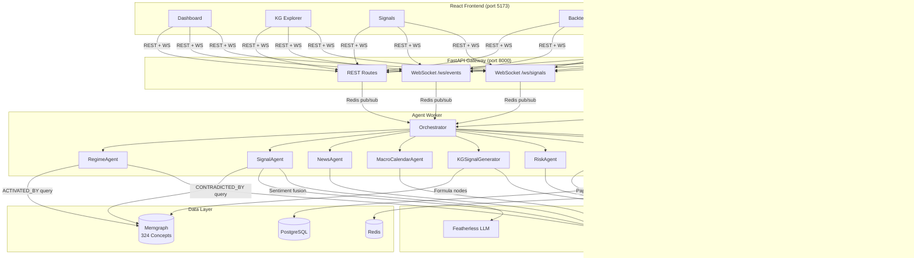
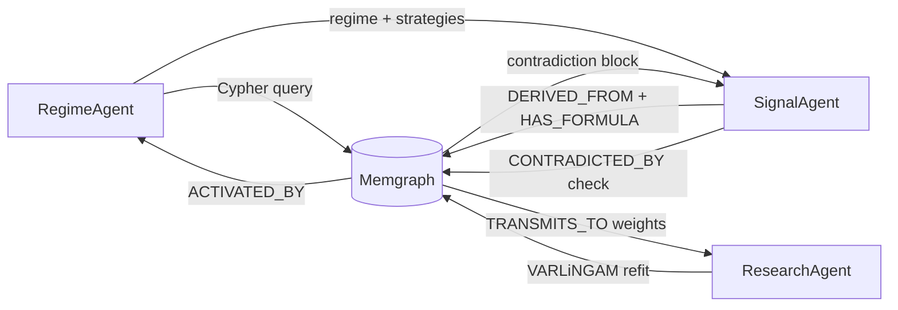
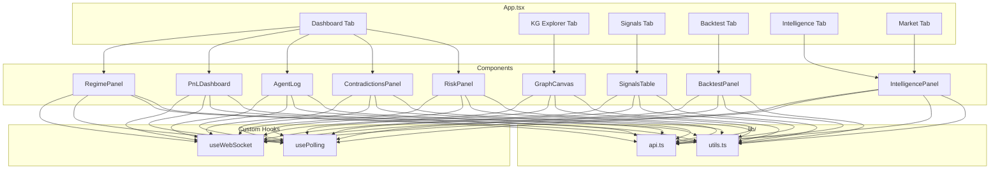
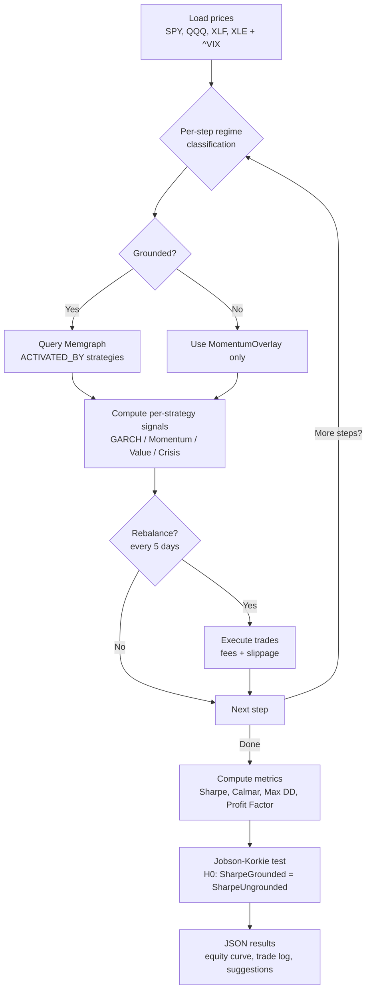

# GraphAlpha

**Knowledge Graph-Grounded Autonomous xStocks Trading Agent**

GraphAlpha is a production-grade agentic trading system built for the WQU MScFE capstone and hackathon circuit. It grounds every trading decision in a 324-concept financial knowledge graph stored in Memgraph, fuses quantitative signals with LLM sentiment, and executes on Kraken's xStocks market — paper or live — with a full risk management stack and a real-time React dashboard.

---

## Architecture Overview



---

## Agent Pipeline

Each cycle (default 5 minutes) the orchestrator runs all sub-agents in sequence:


### Sub-Agent Responsibilities

| Agent | File | Cycle | Responsibility |
|---|---|---|---|
| **RegimeAgent** | `regime_agent.py` | Every tick | Classifies market regime (7 regimes) from SPY, VIX, TNX, HYG via yfinance; queries Memgraph for `ACTIVATED_BY` strategies |
| **SignalAgent** | `signal_agent.py` | Every tick | Generates per-strategy quant signals (GARCH, BN, DYNOTEARS, momentum); fuses 70/30 with Featherless LLM sentiment; checks `CONTRADICTED_BY` edges |
| **NewsAgent** | `news_agent.py` | Every tick | RSS sentiment aggregation; produces per-ticker and per-concept sentiment scores |
| **MacroCalendarAgent** | `macro_calendar.py` | Every hour | Upcoming macro events; produces pre-event size modifiers that reduce signal scores |
| **KGSignalGenerator** | `kg_signal_generator.py` | Every tick | Evaluates KG Formula nodes against ticker prices; merges results into main signal list |
| **RiskAgent** | `risk_agent.py` | Every tick | Half-Kelly position sizing, parametric VaR (99% confidence), sector concentration caps (40%), max position caps (15-20%) |
| **ExecutionAgent** | `execution_agent.py` | Every tick | Submits orders to Kraken (paper or live); writes immutable audit log to PostgreSQL |
| **ResearchAgent** | `research_agent.py` | Every hour | VARLiNGAM weekly refit; updates `TRANSMITS_TO` causal edge weights; Speechmatics earnings transcription; FRED macro ingestion |

---

## Knowledge Graph

Loaded from `master.cypher` (7,200+ lines) into Memgraph via a one-shot graph-loader container.

### Stats

| Type | Count |
|---|---|
| Concepts | 324 |
| Categories | 45 |
| Formulas | 99 |
| Strategies | 26 |
| Regimes | 7 |
| Tickers | 10 |
| Relationship types | 18 |
| QuizQuestion nodes | 51 |

### 18 Relationship Types

`PREREQ_OF` · `BELONGS_TO` · `HAS_FORMULA` · `DERIVED_FROM` · `ACTIVATED_BY` · `CONTRADICTED_BY` · `TRANSMITS_TO` · `MONITORS` · `REPLICATES_WITH` · `HEDGES` · `GENERALIZES_TO` · `MOTIVATES` · `TRAINED_BY` · `EVALUATED_BY` · `FITTED_TO` · `CORRELATED_WITH` · `HAS_SIGNAL` · `TESTS`

### Operational Flow



---

## API Reference

All endpoints documented at http://localhost:8000/docs.

### REST Endpoints

| Method | Path | Description |
|---|---|---|
| `GET` | `/health` | Health check |
| `GET` | `/agent/status` | Latest cycle: regime, confidence, strategies, signals, halted |
| `GET` | `/signals` | Order history (paginated, up to 200 rows) |
| `GET` | `/signals/live` | Latest signals cached in Redis |
| `GET` | `/positions` | Open positions |
| `GET` | `/positions/portfolio` | NAV, cash, drawdown, halt status |
| `GET` | `/graph/nodes` | KG nodes (filter by label, limit) |
| `GET` | `/graph/edges` | KG edges (limit) |
| `GET` | `/graph/regime?regime=X` | Strategies + concepts activated by regime X |
| `GET` | `/graph/contradictions` | All active CONTRADICTED_BY pairs |
| `GET` | `/market/quotes` | Cross-asset quotes (watchlist or custom tickers) with realised vol and IV rank |
| `GET` | `/market/watchlist` | Default 6-class watchlist |
| `GET` | `/intelligence/news` | Latest news sentiment snapshot |
| `GET` | `/intelligence/macro` | Upcoming macro events and pre-event signals |
| `POST` | `/backtest/run` | Trigger walk-forward backtest (async background task) |
| `GET` | `/backtest/status` | Poll backtest completion + results |

### WebSocket Endpoints

| Path | Description |
|---|---|
| `WS /ws/events` | Live agent event stream (Redis pub/sub relay) |
| `WS /ws/signals` | Latest signals pushed every 5 seconds |

---

## Frontend

React + TypeScript + Vite + Tailwind CSS + Sigma.js



### Components

| Component | Purpose |
|---|---|
| `RegimePanel` | Live regime display with confidence bar and active strategies list |
| `PnLDashboard` | NAV / P&L stats, positions table, NAV sparkline |
| `GraphCanvas` | Interactive Sigma.js KG with ForceAtlas2 layout, node type filter, detail sidebar |
| `AgentLog` | WebSocket live event stream with status indicator |
| `SignalsTable` | Paginated order history with paper/live mode badge and direction colours |
| `BacktestPanel` | Run ablation backtest, display metrics table and Jobson-Korkie result |
| `ContradictionsPanel` | Live `CONTRADICTED_BY` edge viewer |
| `RiskPanel` | Risk metrics display |
| `IntelligencePanel` | News sentiment and macro calendar display |

### Hooks

| Hook | Purpose |
|---|---|
| `useWebSocket` | Auto-reconnecting WebSocket hook for live events and signals |
| `usePolling` | Generic polling hook with configurable interval |

---

## Backtest Engine

Walk-forward simulation engine with full academic validation.



### Metrics Produced

| Metric | Purpose |
|---|---|
| Total Return | Raw P&L over the period |
| Sharpe Ratio | Risk-adjusted return (annualised, rf=5%) |
| Calmar Ratio | Return / Max Drawdown |
| Max Drawdown | Worst peak-to-trough loss |
| Annualised Volatility | Daily std x sqrt(252) |
| Profit Factor | Gross profit / Gross loss |
| Win Rate | Fraction of profitable trades |
| Avg Hold Days | Average position holding period |
| **Jobson-Korkie z-stat** | Tests H0: Sharpe(grounded) = Sharpe(ungrounded) |
| **JK p-value** | p < 0.05 indicates statistically significant outperformance |

### Modes

- **KG-grounded**: regime triggers graph query → only graph-sanctioned strategies produce signals
- **Ungrounded baseline**: always runs MomentumOverlay regardless of regime or graph state
- **Ablation**: run both, compare via Jobson-Korkie

---

## Environment Variables

```env
# ── Memgraph ────────────────────────────────────────────────────
MEMGRAPH_HOST=memgraph
MEMGRAPH_PORT=7687

# ── PostgreSQL ──────────────────────────────────────────────────
POSTGRES_HOST=postgres
POSTGRES_DB=graphalpha
POSTGRES_USER=graphalpha
POSTGRES_PASSWORD=changeme

# ── Redis ───────────────────────────────────────────────────────
REDIS_HOST=redis
REDIS_PORT=6379

# ── Featherless (LLM sentiment) ─────────────────────────────────
FEATHERLESS_BASE_URL=https://api.featherless.ai/v1
FEATHERLESS_API_KEY=
FEATHERLESS_MODEL=

# ── Kraken (trading) ────────────────────────────────────────────
KRAKEN_API_KEY=
KRAKEN_API_SECRET=
KRAKEN_TRADING_MODE=paper          # paper | live — NEVER set live manually

# ── Speechmatics (earnings transcription) ───────────────────────
SPEECHMATICS_API_KEY=

# ── FRED (macro data) ───────────────────────────────────────────
FRED_API_KEY=

# ── Agent behaviour ─────────────────────────────────────────────
AGENT_LOOP_INTERVAL_SECONDS=300    # 5-minute cycle
NEWS_CYCLE_TICKS=1                 # every tick (~5 min)
MACRO_CYCLE_TICKS=12               # every ~1 hour
RESEARCH_CYCLE_TICKS=12            # every ~1 hour
AGENT_MAX_DRAWDOWN_HALT=0.10       # halt at 10% drawdown from peak
KG_SIGNAL_TICKERS=SPY,QQQ,TLT,GLD,BTC-USD

# ── Risk limits ─────────────────────────────────────────────────
AGENT_KELLY_FRACTION=0.5           # half-Kelly multiplier
AGENT_MAX_POSITION_PCT=0.20        # max 20% NAV per position
RISK_MAX_SECTOR_PCT=0.40           # max 40% NAV per sector
RISK_VAR_CONFIDENCE=0.99
RISK_MAX_VAR_PCT=0.05              # reject order if VaR contribution > 5% NAV

# ── API ─────────────────────────────────────────────────────────
API_HOST=0.0.0.0
API_PORT=8000
API_SECRET_KEY=change_this_in_production
CORS_ORIGINS=http://localhost:5173,http://localhost:3000,https://your-app.vercel.app

# ── Environment ─────────────────────────────────────────────────
ENVIRONMENT=development            # development | production
```

---

## Quick Start (Local Docker)

### Prerequisites

- Docker Desktop or Docker Engine + Compose plugin
- 8 GB RAM minimum (16 GB recommended — Memgraph alone takes up to 4 GB)
- Ports 5173, 8000, 7687, 3000, 5432, 6379 available

### 1. Clone and configure

```bash
git clone <your-repo-url> graphalpha
cd graphalpha
cp .env.example .env
```

Open `.env` and set at minimum:

```env
POSTGRES_PASSWORD=anysecrethere
FEATHERLESS_API_KEY=your_key        # get from featherless.ai
FEATHERLESS_MODEL=your_model_id     # e.g. a finance-tuned LLaMA variant
KRAKEN_API_KEY=your_key             # required for live mode only
KRAKEN_API_SECRET=your_secret       # required for live mode only
```

All other values have working defaults for local development.

### 2. Boot everything

```bash
make up
```

This command:
1. Builds all Docker images (agent, api, frontend)
2. Starts Memgraph, PostgreSQL, Redis
3. Waits for health checks to pass
4. Runs the graph-loader one-shot container (loads all 7,200+ lines of `master.cypher`)
5. Starts the API, agent worker, and frontend dev server

**Access points after `make up`:**

| Service | URL |
|---|---|
| Frontend dashboard | http://localhost:5173 |
| API + Swagger docs | http://localhost:8000/docs |
| Memgraph Lab (KG browser) | http://localhost:3000 |
| Prometheus (monitoring profile) | http://localhost:9090 |
| Grafana (monitoring profile) | http://localhost:3001 |

### 3. Verify the graph loaded

```bash
make verify-graph
```

Expected output: Concept ~324, Strategy ~26, Regime 7, Formula ~99.

### 4. Watch the agent run

```bash
make logs-agent
```

The orchestrator runs every 300 seconds by default. The frontend dashboard updates live via WebSocket.

---

## Makefile Reference

```bash
make up                  # Build + start all services + load KG
make down                # Stop and remove containers
make logs                # Follow API + agent logs
make logs-agent          # Follow agent worker only
make load-graph          # Reload master.cypher into running Memgraph
make verify-graph        # Print node/edge counts from Memgraph
make shell-memgraph      # Open mgconsole Cypher shell
make shell-api           # Bash into running API container
make shell-agent         # Bash into running agent container
make test                # Run API tests
make test-agents         # Run agent tests
make backtest            # Run walk-forward backtest (KG-grounded)
make backtest-ablation   # Run both KG-grounded and ungrounded, print comparison
make up-monitoring       # Start Prometheus + Grafana
make enable-live-trading # Prompts for CONFIRM; switches paper -> live in .env
make deploy              # Deploy to Vultr VM
```

---

## Testing Checklist

### Layer 1 — Infrastructure

```bash
docker compose ps                        # all services healthy
make verify-graph                        # Concept ~324, Strategy ~26, Regime 7
curl http://localhost:8000/health        # {"status":"ok","version":"1.0.0"}
docker compose exec postgres psql -U graphalpha -c "\dt"
# positions, order_audit, portfolio_state, backtest_runs, agent_cycle_log
docker compose exec redis redis-cli ping # PONG
```

### Layer 2 — Knowledge Graph

In Memgraph Lab (http://localhost:3000):

```cypher
MATCH (s:Strategy)-[:ACTIVATED_BY]->(r:Regime) RETURN s.name, r.name LIMIT 20;
MATCH (c1:Concept)-[:CONTRADICTED_BY]->(c2:Concept) RETURN c1.name, c2.name;
MATCH (c:Concept)-[:HAS_FORMULA]->(f:Formula) RETURN c.name, f.expression LIMIT 10;
MATCH (s:Strategy) WHERE NOT (s)-[:DERIVED_FROM]->() OR NOT (s)-[:ACTIVATED_BY]->() RETURN s.name;
-- Expected: empty
```

### Layer 3 — Agent Pipeline

```bash
make logs-agent
# Wait up to 30s for first cycle:
#   Regime: <name> (confidence=0.XX)
#   NewsAgent: N articles
#   Total signals this cycle: N
#   Risk: N/N signals approved
#   Executed N orders [paper mode]

curl http://localhost:8000/agent/status | python3 -m json.tool
docker compose exec redis redis-cli get graphalpha:latest_signals | python3 -m json.tool
docker compose exec redis redis-cli get graphalpha:news_latest | python3 -m json.tool
docker compose exec redis redis-cli get graphalpha:macro_calendar | python3 -m json.tool
```

### Layer 4 — Risk Controls

```bash
docker compose exec agent-worker python3
```

```python
import asyncio
from risk_agent import RiskAgent

agent = RiskAgent()
mock_signal = {
    "strategy": "TestStrategy", "ticker": "SPY", "kraken_pair": "SPYXUSD",
    "direction": "buy", "score": 0.85, "quant_score": 0.9,
    "sentiment_score": 0.7, "reasoning": "test", "graph_path": [], "regime": "BullMarket"
}
approved = asyncio.run(agent.run([mock_signal]))
# Expected: one approved order with quantity > 0, kelly_fraction between 0 and 0.5
```

### Layer 5 — Execution (paper mode)

```bash
grep KRAKEN_TRADING_MODE .env      # Expected: paper

# After one agent cycle:
docker compose exec postgres psql -U graphalpha -c \
  "SELECT order_id, ticker, direction, quantity, fill_price, mode FROM order_audit LIMIT 5;"
docker compose exec postgres psql -U graphalpha -c \
  "SELECT ticker, direction, quantity, avg_entry_price FROM positions WHERE status='open';"
```

### Layer 6 — Backtest

```bash
make backtest-ablation
# Expected JSON with sharpe_ratio, calmar_ratio, max_drawdown, jk_z_stat, jk_p_value
```

### Layer 7 — Frontend

Open http://localhost:5173 and verify:

- **Dashboard**: Regime name displayed, confidence bar non-zero, active strategies populated, contradictions count visible, agent log receiving events, NAV = $10,000
- **KG Explorer**: Graph renders within 5s, nodes coloured per type, clicking a node opens detail sidebar, filter reloads graph, zoom/reset work
- **Signals**: Table renders, mode badge shows "paper", direction column coloured
- **Backtest**: Date inputs pre-filled, "Run Backtest" triggers loading, metrics populate after completion, Jobson-Korkie result appears
- **Intelligence**: News sentiment and macro calendar populated after first cycle
- **Market**: Watchlist displays with price, daily change, realised vol for each asset class

### Layer 8 — WebSocket

```bash
curl --include \
  --no-buffer \
  --header "Connection: Upgrade" \
  --header "Upgrade: websocket" \
  --header "Sec-WebSocket-Key: x3JJHMbDL1EzLkh9GBhXDw==" \
  --header "Sec-WebSocket-Version: 13" \
  http://localhost:8000/ws/events
# Expected: HTTP 101 Switching Protocols
```

---

## Backtest Metrics Validation

```bash
docker compose --profile backtest run --rm backtest python engine.py \
  --start 2022-01-01 --end 2022-12-31 --use-graph
```

Expected output:
```json
{
  "total_return": <float>,
  "sharpe_ratio": <float>,
  "calmar_ratio": <float>,
  "max_drawdown": <negative float>,
  "ann_volatility": <float between 0.05 and 0.50>,
  "n_days": <integer near 252>,
  "final_nav": <float near 10000>,
  "use_graph": true,
  "jk_z_stat": <float>,
  "jk_p_value": <float between 0 and 1>,
  "jk_significant": <bool>
}
```

Sanity checks:
- `max_drawdown` must be negative
- `ann_volatility` between 0.05 and 0.50 for a realistic period
- `n_days` close to trading days in the range
- `jk_p_value` rarely < 0.05 on a single year — run 2021-2023 for meaningful results

---

## Production Deployment (Vultr)

### One-time Vultr VM setup

```bash
./scripts/deploy_vultr.sh 123.456.789.0
```

Then edit `.env` on the VM to add production API keys, and restart:

```bash
ssh root@your-vultr-ip
cd /opt/graphalpha
nano .env                          # set all secrets
docker compose -f docker-compose.yml -f docker-compose.prod.yml restart
```

### Frontend on Vercel

```bash
cd frontend
vercel --prod
```

Set root directory to `frontend`, framework to Vite, env var `VITE_API_URL = http://your-vultr-ip:8000`.

### Port exposure on Vultr

| Port | Service | Exposure |
|---|---|---|
| 8000 | FastAPI | Public (needed by Vercel frontend) |
| 7687 | Memgraph Bolt | Private only |
| 5432 | PostgreSQL | Private only |
| 6379 | Redis | Private only |
| 3000 | Memgraph Lab | Private only |

### Enable live trading (only after 30-day paper run)

```bash
make enable-live-trading
# Type CONFIRM when prompted
```

---

## Academic Differentiators (Capstone Thesis Points)

1. **Knowledge graph-grounded signal selection** — No other WQU MScFE capstone uses a live financial KG to constrain agent decisions at runtime. The graph is a causal model that gates which strategies are epistemically valid for the current market regime.

2. **CONTRADICTED_BY check** — SignalAgent traverses `CONTRADICTED_BY` edges every cycle and blocks signals from strategies whose concepts are mutually contradicting. This can be toggled off for a clean ablation study.

3. **Jobson-Korkie statistical significance** — The backtest engine implements the full Jobson-Korkie (1981) test. p < 0.05 over 3 years of walk-forward data provides publishable evidence of outperformance from KG grounding.

4. **51 QuizQuestion nodes as validation harness** — The M6-M8 Q&A bank is encoded as `QuizQuestion` nodes with `TESTS` edges. This enables automated checks that the KG covers its claimed domain and creates a DPO dataset for future fine-tuning.

5. **VARLiNGAM-derived TRANSMITS_TO weights** — ResearchAgent refits the VARLiNGAM model weekly on fresh price data and updates Memgraph `TRANSMITS_TO` edges. The graph evolves with the market.

6. **7-agent orchestration with signal overlays** — NewsAgent and MacroCalendarAgent produce per-ticker sentiment and pre-event size modifiers that the orchestrator merges into the signal list before risk evaluation, providing multi-layer signal enrichment beyond the core quant+LLM fusion.

---

## Troubleshooting

**`make up` hangs at graph-loader**

The loader waits for Memgraph's Bolt port. If Memgraph is slow to start, run `make load-graph` separately after `docker compose ps` shows Memgraph healthy.

**Agent worker exits immediately**

Check `docker compose logs agent-worker`. Most common cause is failed Memgraph connection. Ensure `depends_on` health checks pass before the agent starts.

**`RegimePanel` shows "Agent unreachable"**

`/agent/status` reads from Redis. It returns safe defaults until the first cycle completes. Wait for the interval or reduce `AGENT_LOOP_INTERVAL_SECONDS` in `.env` for testing.

**Sigma.js graph is empty**

The graph API returns nodes from Memgraph. If the loader failed silently, Memgraph has no data. Run `make verify-graph` and `make load-graph` if counts are zero.

**Featherless returns 0.0 sentiment every cycle**

If `FEATHERLESS_API_KEY` is empty, the agent falls back to 0.0 sentiment. The signal still runs on quant score alone — safe and expected.

**Paper orders not appearing in Postgres**

If no strategies are active for the current regime, no signals are generated. Check:
```cypher
MATCH (s:Strategy) WHERE s.status = 'active' RETURN s.name, s.strategy_type;
```
If empty, verify `SET s.status = 'active'` lines in `master.cypher`.
