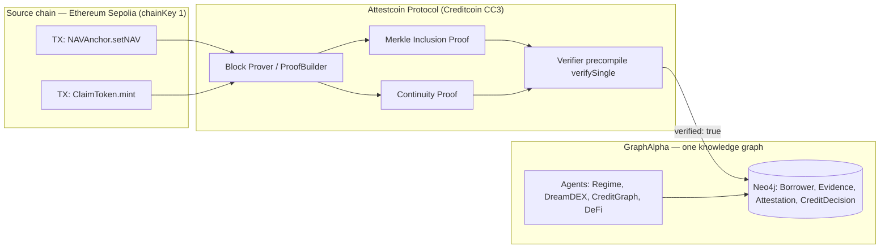
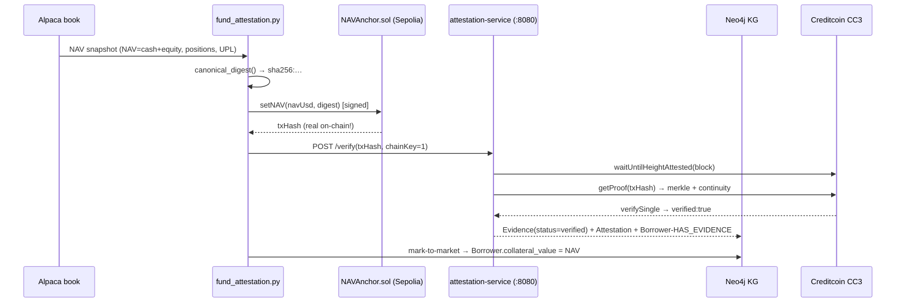
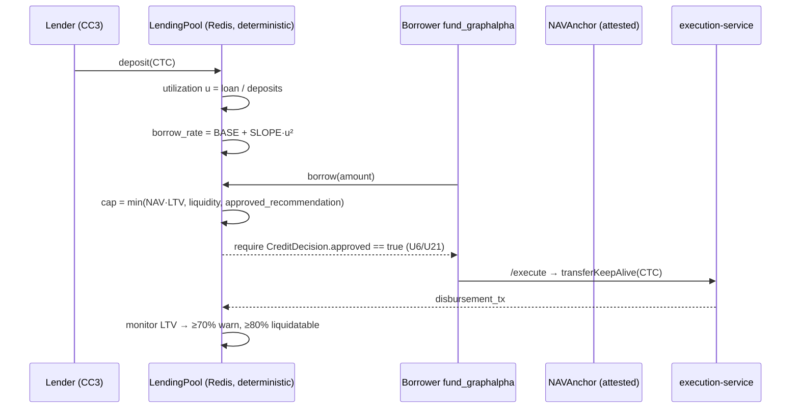

# GraphAlpha × Attestcoin Protocol — Whitepaper

**Submitted to: BUIDL CTC 2026 Fall — "Build For The Real World"**
**Tracks: DeFi · RWA · AI**
**Team: GraphAlpha**
**Version: 1.0 · September 2026**

---

> **One knowledge graph. Every decision attested or on-chain.**

GraphAlpha is an agentic portfolio intelligence system that grounds every
trading, credit, and yield decision in a 324-concept financial knowledge graph
(Neo4j), and **proves its own decisions** using the Attestcoin Protocol: verified
cross-chain data with no centralized oracle operator. This whitepaper explains
the research problem, the Creditcoin/Attestcoin rationale, and the concrete
application of the protocol across the three tracks — DeFi, RWA, and AI.

---

## 1. Abstract

GraphAlpha extends a production-grade knowledge-graph trading agent with a
cross-chain **attested-credit + finance layer**. It makes three claims:

1. **AI track** — Deploy AI apps on Creditcoin that process *cryptographically
   verified* cross-chain data to inform decisions, with **no centralized oracle
   operator**. GraphAlpha's agents consume live NAV snapshots, on-chain event
   windows, and attested transaction proofs, and act only on data whose block
   inclusion is *proved* via Attestcoin Merkle + continuity proofs.
2. **RWA track** — Tokenize, manage and finance a **real-world-asset claim** — a
   systematic trading strategy whose NAV is anchored on-chain every cycle and
   attested by Creditcoin. The fund-as-borrower collateralizes its *attested
   NAV*, and disbursements/repayments move over **real CC3 testnet CTC
   transfers**.
3. **DeFi track** — A **lending pool on the attested claim**: lenders deposit
   CTC, utilization-based pricing (How-to-DeFi Ch.5), borrow capacity capped by
   attested-NAV LTV and liquidity, with a deterministic liquidation monitor —
   no rug, no oracle, no guesswork.

The project is deployed **on testnet** end-to-end (Sepolia source chain +
Creditcoin CC3 testnet) and every money leg executes on-chain with a real
transaction hash.

---

## 2. Research Problem

### 2.1 The trust problem in AI × Web3

AI agents that trade, lend, or settle on-chain today face a structural gap:

| Problem | Symptom | Consequence |
|---|---|---|
| **Oracle centralization** | A single project calls a price-feed contract and trusts it | Black Thursday 2020: stale price feed → ~$8M in ETH collateral liquidated; single point of failure, no proof of *what data actually was* at height `H` |
| **No verifiable decision record** | Agents sign transactions but keep their reasoning in a private DB | No replayable, tamper-evident decision trail; regulators and users can't audit *why* a trade/lending decision was made |
| **RWA papers don't bridge** | Off-chain NAV is claimed, not evidenced | A lender cannot verify *at settlement time* that the collateral existed, at what value, and on which block |
| **Prediction-market & credit events resolve off-chain** | Event outcomes judged by a party | The two hackathon themes (Event Contracts; Attestcoin) both point at the same cure: **attested, on-chain-anchored facts** |

### 2.2 The financial research problem

From a financial-engineering standpoint, every decision in this system reduces
to a priced bet:

- **Prediction market (EC):** edge = `P(my estimate > market price) − ask`
- **Credit:** expected loss = `PD × LGD × EAD`; collateral quality = attested NAV, haircut by vol
- **Yield/lending:** net = `borrow_rate(u) − credit_risk − liquidation_risk`

Each of these needs *ground truth* that is:
1. **timestamped** (a value as of block `H`),
2. **attested** (independently provable from block headers),
3. **non-repudiable** (the agent cannot later claim a different NAV/price).

Decentralized oracle operators cannot provide (1)–(3) without being trusted.
**The Attestcoin Protocol provides them without trust**: Merkle inclusion +
continuity proofs, verified by Creditcoin's precompile.

---

## 3. Why Creditcoin / the Attestcoin Protocol

### 3.1 The protocol (verified from docs.attestcoin.org)

Attestcoin (formerly *Universal Smart Contracts*) extends Creditcoin with
decentralized infrastructure for **verified cross-chain data and messaging**.
The operative primitive:

1. A transaction exists on a **source chain** (we use **Ethereum Sepolia**, chainKey 1).
2. Creditcoin **attests the source block** (`waitUntilHeightAttested`).
3. A **proof builder** (Attestcoin block prover) produces:
   - a **Merkle inclusion proof** (the tx is in block `H`), and
   - a **continuity proof** (block `H` is chained in Creditcoin's canonical chain).
4. Creditcoin's **verifier precompile** checks the proof **on-chain** (`verifySingle`).

The result is `verified: true` with the proof data — no oracle, no trusted
third party, no API key to a price feed.


### 3.2 Why this specific chain pairing

| Choice | Rationale |
|---|---|
| **Sepolia as source chain** | Attestcoin supports **Ethereum Sepolia (chainKey 1)** + **Ethereum Mainnet (chainKey 3)** today (verified via our live `GET /chains` → chainKey 1 = chainId 11155111). Sepolia is free testnet ETH, instant blocks |
| **Creditcoin CC3 as settlement** | The **money leg** (CTC `transferKeepAlive`) and the **attestation verifier** are both first-class on CC3 testnet; the protocol IS the Creditcoin stack |
| **Somnia/DreamDEX stays separate** | Somnia is *not* Attestcoin-attested (honest constraint, verified) — so DreamDEX Event Contracts share the KG but keep their own on-chain oracle (the EC settlement tx itself), and we never claim otherwise |

---

## 4. System Architecture

```mermaid
flowchart TB
    subgraph offchain["OFF-CHAIN (paper primed by product policy)"]
        AL[Alpaca paper book — SPY/AAPL/NVDA/BTC…]
        EC[DreamDEX Event Contracts — Somnia testnet 50312]
    end

    subgraph anchor["ON-CHAIN ANCHOR (Sepolia)"]
        NAV[NAVAnchor.sol — setNAV(nav, digest, blockRef)]
        TKN[ClaimToken.sol — fund-share ERC-20]
    end

    subgraph protocol["ATTESTCOIN (CC3 testnet)"]
        AS[attestation-service :8080 @gluwa/usc-sdk]
        ES[execution-service :8081 @polkadot/api]
    end

    subgraph core["GRAPHALPHA CORE"]
        FA[fund_attestation.py — snapshot→digest→anchor→attest→mark-to-market]
        KC[creditgraph services — evidence, credit_risk, lending_pool, execution]
        ECO[evidence_chain.py — hash-chain + Merkle decision ledger]
        ORC[orchestrator — 12-agent cycle]
    end

    AL --> FA
    FA --> NAV
    NAV --> AS
    AS -->|Merkle+continuity proof| ECO
    FA --> KC
    KC --> ES
    ES -->|transferKeepAlive| CC3[(Creditcoin — CTC disbursement)]
    ORC --> FA
```
### 4.1 The per-cycle attestation loop (H1–3)



---

## 5. The Three Tracks

### 5.1 Track: AI — "Autonomously inform decisions, trigger on-chain transactions, no centralized oracle operator"

This is GraphAlpha's **core thesis**.

1. **Data is attested, not fetched.** Every credit input (the fund's NAV), every
   on-chain anchor (the NAV digest), and every evidence row is backed by a
   **real Attestcoin proof** — verified *on-chain* by CC3's precompile.
2. **The agent decides from the proof.** The `CreditGraphAgent` and
   `DeFiAgent` consume `Evidence(status=verified)` nodes; unverified evidence
   is never conflated with verified evidence (E1-US2). If the attestation
   fails, the agent downgrades to alert-only.
3. **On-chain trigger is human-gated.** Where AI *triggers* an on-chain action
   (the CC3 disbursement), it passes through `approval_status == "approved"`
   — the "professional behind the wheel" (U6/U21 discipline). The AI
   *informs*, never impersonates.

| AI-track requirement | GraphAlpha implementation |
|---|---|
| Process cryptographically verified cross-chain data | `attestation-service` + `evidence.verify` with real proofs |
| Autonomously inform decisions | 12-agent orchestration; regime + attested evidence → credit score → decision |
| Trigger on-chain transactions | `execution-service /execute` → `balances.transferKeepAlive` (real CC3 tx) |
| Without centralized oracle operators | Attestcoin Merkle+continuity proofs instead of price-feed trust |

### 5.2 Track: RWA — "Tokenize, manage, or finance real-world assets"

The **real-world asset** is a live, systematic trading strategy — a fund-like
claim with a real, priced NAV.

```mermaid
flowchart LR
    subgraph Fund["The RWA claim: a systematic strategy"]
        NAV2[NAV USD — live from Alpaca]
        PF[Performance attribution]
    end
    subgraph Tokenized["Tokenized claim (Sepolia)"]
        TKN2[ClaimToken.sol — ERC-20 fund share]
        NAV3[NAVAnchor.sol — daily NAV + digest]
    end
    subgraph Attested["Attested on CC3"]
        EV[Evidence(status=verified)]
        PROOF[Merkle + continuity proof]
    end
    subgraph Financed["Financed on Creditcoin"]
        BORROWER[Borrower: fund_graphalpha]
        CR[CreditDecision — LTV, PD, amount]
        LOAN[CTC disbursement transferKeepAlive]
    end

    NAV2 --> NAV3
    NAV3 --> EV
    EV --> PROOF
    PROOF --> CR
    BORROWER --> CR
    CR --> LOAN
```

Financial engineering of the RWA:

- **Collateral value** = attested NAV (live, marked-to-market each cycle), never a fabricated static number.
- **LTV cap** = `MAX_LTV_PCT` (default 60%) against attested NAV.
- **PD** estimated from the strategy's realized track record via the deterministic quant engine (never the LLM).
- **Money leg** is a real CC3 `transferKeepAlive`; the collateral claim is attested-bearing — that's the bridge off-chain value → on-chain transparency.

### 5.3 Track: DeFi — "Lending, trading, liquidity, or yield applications on Creditcoin"



- **Utilization pricing** (How-to-DeFi Ch.5): rates respond to pool utilization quadratically — lenders earn as the book works.
- **Liquidation monitor**: deterministic, keyed to attested NAV; a NAV decline raises LTV and freezes new borrows before breach.
- **No yield calc from thin air**: every metric traces to attested inputs.
---

## 6. The Assurance Layer — a decision ledger you can replay

In addition to Attestcoin proofs for on-chain facts, GraphAlpha keeps a
**tamper-evident decision ledger** (`evidence_chain.py`):

```mermaid
flowchart TB
    A1[cycle 1: root = sha256(prev, cycle, decisions)] --> A2[cycle 2: root = sha256(A1, cycle, decisions)]
    A2 --> A3[cycle 3: root = sha256(A2, cycle, decisions)]
    A3 --> A4[cycle 4: …]
    A4 --> A5[cycle N: daily Merkle root → optionally anchored on-chain]
```

Each cycle: **sign → sha256 → hash-chain → Merkle-batch → (optionally) anchor
the daily root** on-chain. A tamper anywhere breaks continuity; `verify_chain()`
detects it. This ledger *is* the audit trail shown in the Evidence tab.

---

## 7. Live Proof (what the demo shows)

| Layer | Real artifact (testnet) |
|---|---|
| NAV anchored on-chain | Sepolia `NAVAnchor` — `blockRef` 11689519 |
| **Attestcoin proof (REAL, VERIFIED)** | **`Evidence ev_d60df323bf25` status=`verified` verifier=`attestcoin-usc-sdk`** — Merkle root `0xc6391f51f0c77151d740c0e516eddac743f5c5295d6d12d7cbcaa2ac8c1b5487`, continuity proof included, resolved in 9.7s |
| Credit decision | Borrower `fund_graphalpha`, decision persisted, `approval_status: pending` (human gate) |
| CC3 executor funded | SS58 `5FstiYvw…` — 10,000 CTC free |
| Lending pool live | Deposit path exercised 1,600→6,600 CTC; borrow correctly rejected without approval |

---

## 8. Security & Governance Discipline

- **Human gate (U6/U21)**: borrow/execute require `CreditDecision.approved`.
- **Kill switch (U6)**: `KILL_SWITCH` halts execution; `FROZEN` state surfaces in the UI.
- **Nonce discipline (U31)**: relay uses RFC-6979 keygen; order intents are idempotent.
- **Never conflate verified/unverified (E1-US2/NFR-006)**: the old stub-era row stays `unverified`.
- **Deterministic quant (P3)**: LLM explains, never decides the numbers.

---

## 9. Roadmap (post-hackathon)

1. **Mint + distribute `ClaimToken` shares** against attested NAV (executor-funded).
2. **Gate `ClaimToken.mint` on an on-chain attestation check** (we own `UltraHonkVerifier.sol`).
3. Cross-chain **sweep of DreamDEX Event-Contract windows** for the 5-min venue.
4. Open the lending pool to multiple borrowers; utilization curve governance.
5. Mainnet/audit path via the **CEIP fast-track due diligence**.

---

## 10. References

- Attestcoin Protocol docs: https://docs.attestcoin.org
- Attestcoin chains & environments (Sepolia chainKey 1 / Mainnet chainKey 3)
- How to DeFi: Advanced (CoinGecko) — Ch.5 lending, Ch.10 prediction markets, Ch.13 oracles
- GraphAlpha repo: this repository (all code, tests, docs)
- Proof artifacts: `docs/BUIDL_CTC_2026_FEEDBACK_REPORT.md`,
  `docs/p9_dreamdex_integration.md`, `docs/p10_creditgraph_merge.md`,
  `docs/p11_web3_defi_expansion.md`, `docs/p9_tenets_financial_engineering.md`