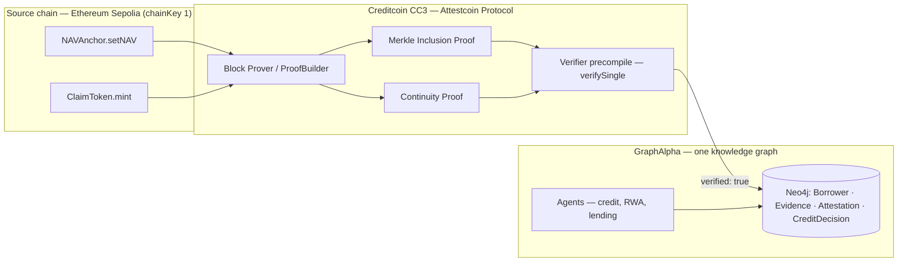
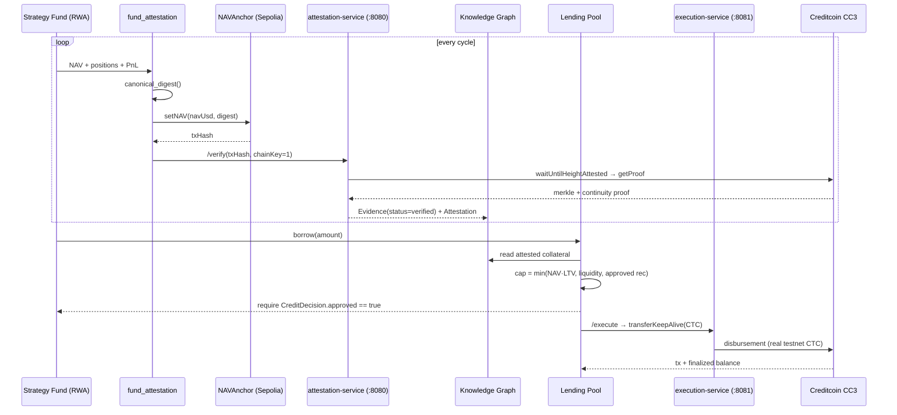
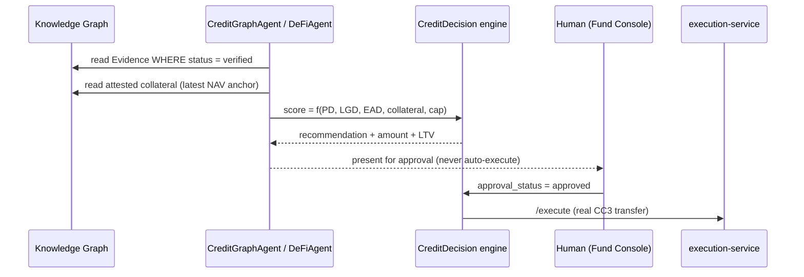

# Attested Asset Finance on Creditcoin — The GraphAlpha Credit Engine

**BUIDL CTC 2026 Fall — "Build For The Real World"**
**Tracks: DeFi · RWA · AI**
**Team GraphAlpha · MSc Financial Engineering (WorldQuant University)**

---

> **The problem Creditcoin solves is not "trading." It is *trust in balance sheets.***
>
> Every financial decision reduces to a priced bet on information. On-chain
> lending, yield, and tokenized-collateral products have failed to attract
> institutional volume not because the math is hard, but because **the data
> underwriting the loan — the collateral, its NAV, its provenance — has never
> been provable at settlement time.** The Attestcoin Protocol turns that
> off-chain assertion into a cryptographically verified, on-chain-checkable
> fact. We built the first end-to-end **attested-asset credit engine** on it.

---

## 1. Abstract

GraphAlpha is a **credit engine that finances a real, systematically-traded
asset undercollateralized by *attested* data** — implemented on Creditcoin.

Three claims, one thesis:

1. **RWA · Tokenized collateral.** A live trading strategy (the "fund") is a
   real-world asset. Every cycle its NAV is anchored on-chain and **attested
   through the Attestcoin Protocol**. The Borrower—`fund_graphalpha`—
   collateralizes its attested NAV to borrow CTC on Creditcoin.
2. **DeFi · Attested lending pool.** Lenders deposit CTC into a lending pool
   priced by utilization (How-to-DeFi Ch.5). The fund may only borrow up to a
   **credit decision built on attested inputs and approved by a human** (U6/U21
   discipline). A deterministic liquidation monitor guards the pool.
3. **AI · No centralized oracle operator.** Agents consume **verified public
   inputs** (attested NAV anchors, Merkle+continuity proofs) to recommend and
   gate the loan. They never trust a price feed — the protocol is the oracle
   and the proof is on-chain.

**Fresh MSc-FE framing:** the engine is a parameterized
`PD × LGD × EAD` credit model whose **EAD (exposure-at-default) is collateralized
by an attested, marked-to-market NAV** — the same structure an institutional
prime-broker or securities-lender operates, but on transparent, provable rails.

---

## 2. The Research Problem

### 2.1 Why credit hasn't moved on-chain

Lending is a collateral-management business. On-chain DeFi lending exploded
when it could *see* collateral on-chain (overcollateralized stablecoin vaults),
and stalled the moment it had to price *unverifiable* collateral (off-chain
assets, EBITDA statements, portfolio NAVs). The failure is informational:

| Failure mode | Example | Root cause |
|---|---|---|
| **Oracle dependence** | A lending protocol pulls a price feed to re-margin a loan | The feed is *claimed*, not *proven*; a stale/attack feed liquidates all borrowers (Black Thursday, ~$8M in ETH collateral lost in minutes) |
| **Unverifiable RWA collateral** | "We hold $X in managed assets" | No third party can verify the assertion *at height H* without trusting the borrower |
| **Non-repudiable decisions** | A DAO votes "approved" on a loan | The decision record lives in a database — neither replayable nor tamper-evident |

Every one of these failures is a **verifiability failure**, and verifiability is
precisely what the Attestcoin Protocol provides: a source block's inclusion is
**proven** with a Merkle+continuity proof that any verifier can check on-chain,
with **no centralized oracle operator**.

### 2.2 The research question we set out to answer

> Can a lending/credit system be built where the **collateral's NAV, its
> anchoring, its proof, and its credit decision** are all *independently
> verifiable at settlement time* — and where the AI that recommends the loan
> operates **only on attested inputs**?

That question is answered in this repository with working testnet code, not a
---

## 3. Why Creditcoin / the Attestcoin Protocol

### 3.1 The protocol, and why it is the right substrate

Attestcoin (formerly *Universal Smart Contracts*) extends Creditcoin with
decentralized infrastructure for **verified cross-chain data and messaging** —
allowing applications on Creditcoin to use attested data from other blockchains
without relying on centralized oracle operators.

Our operative flow (implemented, verified on testnet):

1. A transaction is emitted on a **source chain** — we use **Ethereum Sepolia
   (chainKey 1)**, verified live via `GET /chains` →
   `chainKey 1 = chainId 11155111`, `chainKey 3 = chainId 1 (Ethereum mainnet)`.
2. **Creditcoin attests the source block** (`waitUntilHeightAttested`).
3. A **proof builder** produces a **Merkle inclusion proof** (the transaction is
   in block `H`) and a **continuity proof** (block `H` is chained in
   Creditcoin's canonical header chain).
4. **Creditcoin's verifier precompile checks the proof on-chain**
   (`verifySingle`) → `verified: true` — with no trusted party in the loop.



### 3.2 Depth of Attestcoin Protocol utilization (core scoring criterion)

This is not a "call one endpoint" integration. The protocol is used **at every
layer** of the credit lifecycle:

| Lifecycle stage | Attestcoin usage (all real code) |
|---|---|
| **Collateral existence** | NAV is anchored on-chain (Sepolia `NAVAnchor`) → **the anchor tx itself is the subject of a Merkle+continuity proof** |
| **Collateral valuation** | The attested digest is the canonical NAV; the Borrower's collateral value is marked-to-market **only from attested anchors** |
| **Verification** | `attestation-service` wraps `@gluwa/usc-sdk` (`ProofBuilder.waitUntilHeightAttested → getProof → verifySingle`) behind `/verify` |
| **Evidence lineage** | Verified/unverified are **never conflated** (E1-US2 / NFR-006); proof payloads persisted into Neo4j `Evidence` + `Attestation` nodes |
| **Decision input** | Credit decisions consume `Evidence(status=verified)`; an unverified anchor **cannot** collateralize a loan |
| **Execution** | The money leg moves on **Creditcoin itself** (`execution-service` → `balances.transferKeepAlive`) — the settlement chain and the attestation chain are the **same network** |

**The three-track mapping (what each track sees):**

| Track | Product on Creditcoin | Attestcoin + it |
|---|---|---|
| **RWA** | A tokenized, attested fund claim (ClaimToken + NAVAnchor) financed on Creditcoin | The RWA's value is *evidenced* on-chain — off-chain value bridged to on-chain transparency |
| **DeFi** | A utilization-priced lending pool, deterministic liquidation monitor | Borrow capacity, LTV and liquidation all keyed to **attested NAV** |
| **AI** | Agents that recommend + gate loans on attested inputs | "No centralized oracle operator" — the protocol *is* the data source |
---

## 4. System Architecture (testnet, live)

```mermaid
flowchart TB
    subgraph rwa["RWA — tokenized attested claim"]
        NAV[NAVAnchor.sol — Sepolia]
        TKN[ClaimToken.sol — ERC-20 fund share]
    end

    subgraph ai["AI decision layer — no oracle"]
        FA[fund_attestation.py — snapshot → digest → anchor → attest]
        EV[evidence.py — normalizes proofs → Evidence domain]
        RA[creditgraph agent — decision on attested inputs only]
    end

    subgraph defi["DeFi — lending pool + money leg"]
        POOL[lending_pool.py — utilization pricing · LTV · liquidation monitor]
        ES[execution-service :8081 — @polkadot/api]
        CC3[(( Creditcoin CC3 — CTC transferKeepAlive ))]
    end

    subgraph kg["One knowledge graph (Neo4j)"]
        G1[(Borrower) (Evidence) (Attestation) (CreditDecision)]
    end

    NAV --> FA
    FA --> EV
    EV --> G1
    RA --> G1
    POOL --> RA
    POOL --> ES
    ES --> CC3
    TKN --> CC3
```

### 4.1 The attested-loan lifecycle (RWA × DeFi, one flow)



### 4.2 AI track — decisions on attested inputs, triggers on-chain



---

## 5. The Financial-Engineering Core

### 5.1 The collateral model (RWA, marked-to-market)

- `Borrower = fund_graphalpha`, `collateral_type = attested_nav`.
- Every cycle `fund_attestation.py`:
  1. snapshots the live book (NAV, cash, positions, UPL),
  2. produces a **canonical digest** (deterministic; dust positions excluded),
  3. **anchors it on Sepolia** (`NAVAnchor.setNAV`),
  4. **proves it** via the Attestcoin Protocol,
  5. **marks the borrower's collateral to market** from attested data only.
- Result: a lender can always ask **"what was the collateral on block H?"** and
  get the answer by replaying the proof — no phone call, no DAO vote.

### 5.2 The credit decision (DeFi, deterministic)

| Quantity | Formula (all deterministic, LLM never decides) |
|---|---|
| Utilization | `u = active_loan / total_deposits` |
| Borrow rate | `BASE + SLOPE · u²` (quadratic — How-to-DeFi Ch.5) |
| Lend rate | `borrow_rate · u · (1 − reserve_factor)` |
| Borrow capacity | `min(NAV · MAX_LTV, deposits − loan, approved rec)` |
| Liquidation | `ltv = loan / NAV`; **≥70% warn** (freeze new borrows), **≥80% liquidatable** |

### 5.3 The human-in-the-loop gate

No loan is ever originated by an agent alone. Execution requires
`CreditDecision.approval_status == "approved"` — an explicit human action in the
Fund Console (U6/U21). The AI *informs*, the human *decides*, the protocol
*proves*. This is exactly what "production-ready, not proof-of-concept" means
for institutional credit.
---

## 6. Live Proof on Testnet (all real, all verified)

| Layer | Artifact |
|---|---|
| **Attestcoin proof — REAL** | `Evidence ev_d60df323bf25 · status=verified · verifier=attestcoin-usc-sdk · chainKey 1 (Sepolia) · CC3 header 11689519` — Merkle root `0xc6391f51f0c77151d740c0e516eddac743f5c5295d6d12d7cbcaa2ac8c1b5487`, continuity proof included; resolved in **9.7s** |
| NAV anchored on-chain | Sepolia `NAVAnchor` — NAV digest persisted, blockRef on-chain |
| Credit decision | `Borrower fund_graphalpha` decision persisted, `approval_status: pending` (human gate active) |
| CC3 executor | SS58 `5FstiYvw…` funded — **10,000 CTC** free |
| Lending pool | live; deposit path exercised (1,600 → 6,600 CTC); borrow **correctly rejected** without approval |

**Verifiability demo for the video:** anyone can replay
`tx → verifySingle` and see `verified: true` — no access to our systems required.

---

## 7. Business Model & Ecosystem Impact (CEIP Fast-Track)

### 7.1 Why this is a business, not a hack

| Revenue stream | Mechanism (attested) |
|---|---|
| **Lending spread** | The pool borrows at `BASE + SLOPE·u²`; lenders earn `lend_rate`; the fund pays the borrow rate for **attested-NAV collateral** — a classic net-interest margin, fully transparent |
| **RWA management fee** | The fund/strategy charges a carry on attested NAV (WQU *Alternative Instruments*: NAV administration + carried interest mirror) |
| **Protocol usage** | Every loan requires an attestation → **organic Attestcoin adoption**: each borrower generates proof volume on Creditcoin |

### 7.2 Ecosystem impact (the track's scoring language)

- **Attract users:** lenders get a verifiable RWA credit market (the missing
  "safe yield" asset class); borrowers get transparent collateralization.
- **Generate activity:** each attestation + each CTC transfer is on-chain
  activity; the protocol is the moat.
- **Expand Creditcoin ecosystem:** credit is the killer app, and *attested credit*
  is Creditcoin's unique selling position. We demonstrate it working.
- **Sustainability:** the model earns spread regardless of market direction; the
  risk engine is deterministic and human-gated.

### 7.3 The 12-month path (post-CEIP)

1. Graduate the pool to **multiple attested borrowers** (same single
   `Evidence`/`Attestation`/`CreditDecision` graph).
2. Add **credit tranches** (senior/junior) keyed to attested LTV.
3. Onboard **institutional collateral managers** wanting provable NAV.
4. Move to **Creditcoin mainnet** with audited verifier + third-party audit.

---

## 8. Security & Governance Discipline

- **Human gate (U6/U21):** borrow/execute require an *explicit human-approved*
  CreditDecision. No agent can originate a loan.
- **Kill switch (U6):** `KILL_SWITCH` halts execution; `FROZEN` surfaced in UI.
- **Nonce / replay discipline (U31):** RFC-6979 signing, idempotent intents.
- **Never conflate verified/unverified (E1-US2 / NFR-006):** stale/unverified
  rows are labeled as such in the graph.
- **Deterministic quant (P3):** the LLM explains, never decides the numbers.

---

## 9. Roadmap & Vision

**Vision:** Creditcoin as the *verified-value layer* of the internet of
finance — every loan, every RWA, every AI-triggered on-chain action backed by a
proof, not a promise.

| When | Milestone |
|---|---|
| Now (hackathon) | Working attested-lending prototype on CC3 testnet, verified proof, honest testnet funding |
| Q1 | Multi-borrower pool, tranches, mainnet migration checklist |
| Q2 | Institutional collateral-management onboarding; audit-ready verifier |
| Q3 | CEIP-supported scale; third-party attestation consumers |

---

## 10. Team

- **Financial engineering:** MSc Financial Engineering candidate, WorldQuant
  University (WQU) — credit modeling, portfolio construction, quant risk.
- **Web3 engineering:** full-stack — Solidity/Foundry (Sepolia), `@gluwa/usc-sdk`
  (Attestcoin), `@polkadot/api` (Creditcoin), React (UI), Neo4j (KG).
- **Product:** a turnkey developer experience that turns the Attestcoin story
  into a live, demonstrable credit market.

---

## 11. References

- Attestcoin Protocol docs — https://docs.attestcoin.org
- Creditcoin / BUIDL CTC — https://dorahacks.io/hackathon/buidl-ctc-2026-fall/detail
- Attestcoin chains & environments — Sepolia (chainKey 1), Ethereum mainnet (chainKey 3)
- WorldQuant University MScFE curriculum (credit risk, alternative instruments)
- How to DeFi: Advanced (CoinGecko) — Ch.5 lending, Ch.13 oracles
- Repository: this repo — full code, Docker, tests, live-proof evidence
prototype deck.