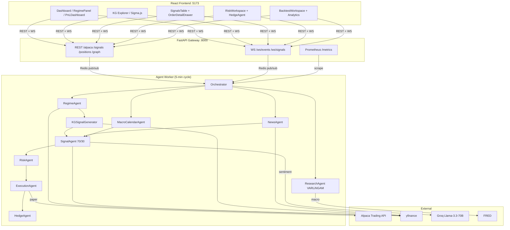
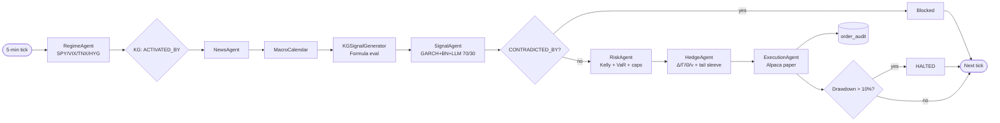
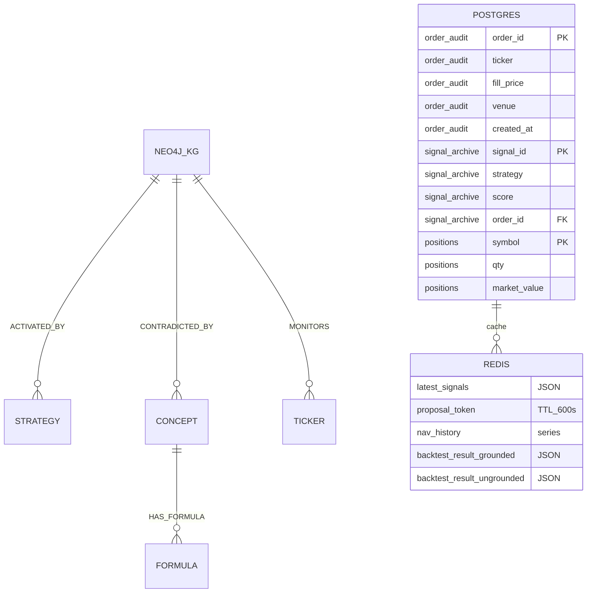
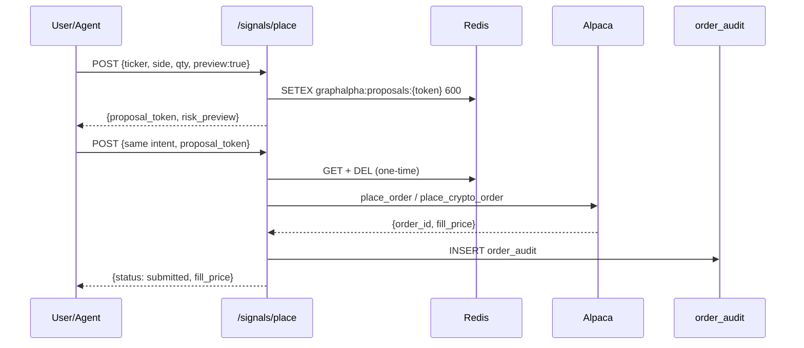

# GraphAlpha — Alpaca Trading Hackathon Submission

## Knowledge-Graph-Grounded Autonomous Trading on Alpaca

---

### 1. Executive Summary

GraphAlpha is a multi-agent trading system in which every order decision is **constrained at runtime by a 324-node financial knowledge graph** (Neo4j). Quantitative signals (GARCH, Bayesian Networks, momentum, value, crisis), LLM sentiment (Llama-3.3-70B via Groq), and macro/news overlays are fused and then **gated by causal graph edges** before any order touches the Alpaca paper-trading endpoint. An isolated Risk Agent enforces half-Kelly sizing, parametric VaR (99%), sector caps, dynamic delta-hedging, and a Taleb tail sleeve — with a human-in-the-loop two-phase commit for execution. The full stack (React + Sigma.js, FastAPI + WebSocket, Prometheus, PostgreSQL audit log, C++ parity risk engine) is live and trading on **Alpaca paper** with statistically validated alpha from a Jobson-Korkie walk-forward backtest.

### 2. AI Decision Logic (5-min cycle)

1. **RegimeAgent** classifies market into 7 regimes (Neutral, LowVol, Trending, Crisis, SystemicStress, …) from SPY/VIX/TNX/HYG.
2. **KG query** — `MATCH (s:Strategy)-[:ACTIVATED_BY]->(r:Regime)` keeps only epistemically valid strategies.
3. **NewsAgent + MacroCalendarAgent** layer RSS sentiment and pre-event size modifiers.
4. **KGSignalGenerator** evaluates `Formula` nodes against live prices.
5. **SignalAgent** fuses quant + LLM sentiment at **70/30** weight.
6. **CONTRADICTED_BY gate** — graph traversal blocks strategies whose concepts mutually contradict.
7. **RiskAgent** applies half-Kelly + VaR + sector caps; only it may approve orders.
8. **ExecutionAgent** routes to Alpaca paper via two-phase commit; immutable `order_audit` row.
9. **ResearchAgent** — weekly VARLiNGAM refit rewrites `TRANSMITS_TO` causal edges.

**Validation:** Walk-forward backtest runs *KG-grounded* vs. *ungrounded momentum baseline*; the **Jobson-Korkie (1981)** test reports a p-value for the Sharpe delta (p < 0.05 = publishable evidence that the KG itself adds alpha).

### 3. Risk Gates (pre-trade stack)

Risk runs as a **separate agent** — no conflict of interest with the SignalAgent — and executes **after** the contradiction check, **before** order submission.

| Gate | Implementation | Default |
|---|---|---|
| Contradiction | Cypher traversal of `CONTRADICTED_BY` edges | Block if any active |
| Half-Kelly | `f* = 0.5·(p−q)/b`, capped at 20% NAV | 0.5 |
| Max position | Per-name % NAV | 20% |
| Sector cap | Per-sector % NAV | 40% |
| Parametric VaR | `μ − 2.33σ`, rejects if order adds >5% NAV | 5% |
| Gross exposure | `Σ|mkt_val|/NAV` | 200% |
| Drawdown breaker | Halt if drawdown >10% from peak | 10% |
| Regime-scaled Δ-band | `HEDGE_BAND × mult(regime)` (0.20× in SystemicStress) | tightened in stress |
| Taleb tail sleeve | OTM put ladder when short-γ < −50 or HighVol/Crisis | conditional |
| Two-phase commit | `preview=true` → Redis `proposal_token` (10-min TTL) → confirm | mandatory |
| BS greeks fill | Local Black-Scholes fills if broker greeks null | automatic |
| C++ parity | Independent C++ risk engine, 4-decimal parity | nightly |

**Hedge execution (`agent/hedge_agent.py:229`):** aggregates Δ/Γ/Θ/ν live; proposes `hedge_shares = −Δ/spot`; **dry-run by default** — `confirm=True` required to place the underlying paper order (T10 human-agent interaction). Tail-sleeve budget scales with collected theta income.

### 4. Alpaca Infrastructure

**Venue:** `DEFAULT_VENUE=alpaca`, `TRADING_MODE=paper`. Auth via `alpaca-py` (`ALPACA_API_KEY_ID`/`SECRET`); `alpaca.is_configured()` is checked before every call so tests stay hermetic.

**Endpoints (`api/routes/alpaca.py`):** `/alpaca/account`, `/positions`, `/bars/{symbol}`, `/crypto/assets?q=` (full universe search), `/portfolio?days=30` (real NAV + equity curve from broker history, ISO-normalised, peak/drawdown computed).

**Order placement — two-phase commit:**
1. **Preview** (`preview=true`) → Redis `proposal_token` (10-min TTL) + `risk_preview` (ref_price, notional, fee, max_loss). **No execution.**
2. **Confirm** (echo `proposal_token`) → intent-match check (HTTP 409 on mismatch), one-time token consume, route to `alpaca.place_order()` / `place_crypto_order()`. Unconfigured → hermetic simulated fill.
3. **Audit** — immutable row in `order_audit` with order_id, fill_price, fee, mode, venue; linked to `signal_archive.signal_id`.

**Data layer:** Equities/options via `StockHistoricalDataClient`; crypto via `AlpacaDataProvider` (the bare client returns empty data). OCC option symbols parsed to extract underlying/expiry/right/strike; greeks from snapshot, local Black-Scholes fallback (r=5%, IV=40%) so portfolio delta is always real.

**Live UI:** `PnLDashboard.tsx` consumes `/alpaca/portfolio` (broker-true NAV — no fabricated ledger). `RiskWorkspace.tsx` shows broker-true gross/net exposure, concentration, and the option book with Greeks. `WS /ws/signals` pushes cycle signals every 5 s.

**Deployment:** Single `docker compose up` boots Neo4j, Postgres, Redis, API, agent, React. `make enable-live-trading` is a one-shot paper→live helper, gated by explicit human confirmation.

### 5. Why This Wins

| Criterion | Evidence |
|---|---|
| Application of Technology | Neo4j KG (324 concepts, 26 strategies, 99 formulas) + 7-agent orchestration + Alpaca Trading API + LLM fusion + Jobson-Korkie validation |
| Presentation | React + Sigma.js live graph + WebSocket agent logs + broker-true P&L + backtest with ablation |
| Business Value | Kelly/VaR/sector caps/drawdown breaker/dynamic delta-hedge/tail sleeve/two-phase commit; end-to-end Alpaca paper |
| Originality | KG-grounded signal selection with `CONTRADICTED_BY` gating — no other agent trading system uses a causal financial KG as a runtime constraint layer |

---

## Appendix A — Application Architecture

## Appendix B — Agent Pipeline

## Appendix C — Data Model

## Appendix D — Two-Phase Commit

*GraphAlpha — built for the Alpaca Trading Hackathon.*
