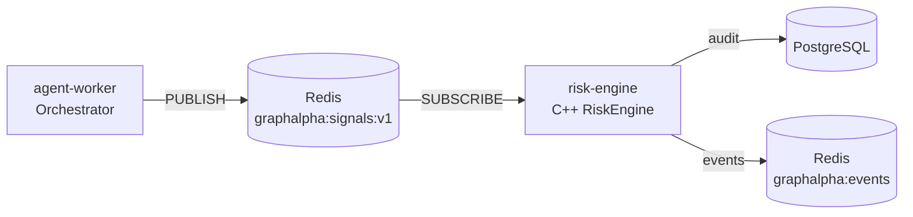

# P5 — Redis Integration

Live signal pipeline: `agent-worker` → Redis `graphalpha:signals:v1` → `risk-engine` → audit/events.

## Architecture



## Feature 1: Signal Publishing (agent-worker)

Signals are validated and published after schema injection (lines 141-165 in `orchestrator.py`).

```python
# After overlay application, signals are validated and published
signals = self._inject_schema_v1(signals, cycle_id, timestamp)
await publish_signal_batch(signals)  # Fire-and-forget
```

## Feature 2: Redis Channel

- **Channel**: `graphalpha:signals:v1` (configurable via `REDIS_SIGNALS_CHANNEL`)
- **Format**: JSON Schema v1 Signal objects
- **Heartbeat**: `graphalpha:heartbeat` key for ops visibility

## Feature 3: RiskEngine Subscription

C++ service subscribes via `REDIS_SUBSCRIBE=1` environment variable.

```cpp
// In main():
const bool redis_subscribe = std::getenv("REDIS_SUBSCRIBE") != nullptr
                            && std::string(std::getenv("REDIS_SUBSCRIBE")) == "1";

// In subscriber mode: processes signals in real-time
while (g_running) {
    redisGetReply(ctx, (void**)&reply);  // Blocking read
    if (message_type == "message") {
        Signal sig = Signal::from_json(json);
        ApprovedOrder order = risk_engine.evaluate(sig, pf, prices);
        // ... audit + event publish
    }
}
```

## Feature 4: Shadow Mode

Parallel-run validation via `SHADOW_COMPARE=1` (C++) and `SHADOW_MODE=true` (Python).

Both paths run simultaneously; C++ writes to `cpp_decision`, Python writes to `python_decision`.

Discrepancies flagged in `shadow_comparison` table.

## Feature 5: Docker Compose

```bash
# Start risk-engine alongside other services
make up-risk-engine

# Or start everything
make up-all
```

The service:
- Waits for `redis` and `postgres` health checks
- Reads `.env` for configuration
- Publishes to `/ws/events` via Redis

## Testing

```bash
# Python tests
pytest tests/test_p5.py -v

# C++ tests (via Docker)
make up-risk-engine  # Builds and runs tests
docker compose logs risk-engine
```

## Operational Notes

- Transient Redis disconnects trigger 2s backoff reconnect
- Signals published during disconnect are **not** replayed (known gap, per spec)
- Paper mode only — live trading gated to P6/P7