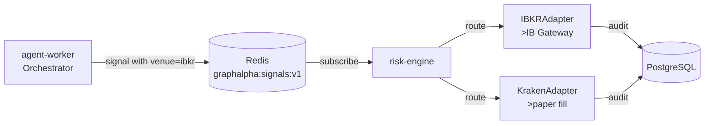

# P6 — Interactive Brokers Integration

Live equity/ETF execution via IBKR alongside crypto on Kraken.

## Architecture



## Feature 1: IB Gateway Docker Service

- Image: `ghcr.io/unusualalpha/ib-gateway-docker:latest` (community headless)
- Paper trading port: 4002
- Credentials via `.env`: `IBKR_USERNAME`, `IBKR_PASSWORD`
- Service runs under `profiles: ["ibkr"]` — only starts when configured

## Feature 2: C++ `IBKRAdapter`

- Implements `VenueAdapter` interface alongside `KrakenAdapter`
- Hard rule: rejects any order where `mode != "paper"` (lines 226-230)
- Contract decomposition: crypto tickers rejected, equity → SMART/USD
- Socket connection with 5s receive timeout for liveness detection

## Feature 3: Venue-Routed ExecutionEngine

```cpp
// ExecutionEngine dispatches by venue field
auto it = adapters_.find(order.venue);
return adapter->submit_order(order, timestamp);
```

Both adapters registered in `run_subscriber_mode()` (main.cpp:190-191).

## Feature 4: Cross-Venue Portfolio State & Risk Aggregation

- `PortfolioLoader` loads positions from Postgres, infers sector via `infer_sector()`
- Sector caps aggregated across venues (QQQ on IBKR + QQQ on Kraken counts together)
- Drawdown circuit breaker trips on combined cross-venue NAV

## Feature 5: Orchestrator Venue Assignment Confirmation

Default routing in `universe.py`:

| Ticker pattern | Venue | venue_symbol |
|----------------|-------|--------------|
| `-USD` suffix or crypto | Kraken | `XBTUSD`, `ETHUSD` |
| Equity/ETF/macro | IBKR | Same as ticker |

Override via `universe.add(ticker, ..., venue="kraken")` for testing.

## Testing

```bash
# Python tests
pytest tests/test_p6.py -v

# C++ tests (via Docker)
make up-risk-engine
docker compose logs risk-engine
```

## Operational Notes

- IBKR paper mode only — live orders rejected at adapter level
- IB Gateway session renews automatically via IBC in container
- Transient disconnects trigger 2s backoff reconnect